# C4 Code Level: GUI Hook Tests

## Overview
- **Name**: GUI Hook Tests
- **Description**: Vitest test suites validating the custom React hooks that provide data fetching, WebSocket, and utility functionality
- **Location**: `gui/src/hooks/__tests__/`
- **Language**: TypeScript
- **Purpose**: Unit tests for 6 custom hooks covering polling behavior, WebSocket reconnection logic, debouncing, API interactions, and store integration

## Code Elements

### Test Suites

#### `useHealth.test.ts` (4 tests)
- "returns healthy when all checks pass" -- mocked 200 response with ok checks
- "returns degraded when status is degraded" -- mocked 503 response
- "returns unhealthy when fetch fails" -- mocked network error
- "polls at the configured interval" -- fake timers, verifies 2 fetch calls after interval
- **Setup**: mocked `globalThis.fetch`, fake timers for polling test
- **Dependencies**: `useHealth`, `renderHook`, `waitFor`, `act`

#### `useWebSocket.test.ts` (7 tests)
- "connects to the given URL" -- verifies constructor called
- "reports connected state after onopen" -- simulateOpen
- "reports reconnecting state after onclose" -- simulateOpen then simulateClose
- "reconnects with exponential backoff" -- 1s first, 2s second, verifies timing
- "resets retry count on successful connection" -- reconnect, open, close uses 1s again
- "sends data when connected" -- verifies sentData array
- "stores the last received message" -- simulateMessage
- "caps backoff delay at 30 seconds" -- 10 disconnects, all reconnected
- **Setup**: `MockWebSocket` class with simulateOpen/Close/Message methods, `mockInstances` array, fake timers
- **Dependencies**: `useWebSocket`, `renderHook`, `act`

#### `useMetrics.test.ts` (3 + 3 tests in 2 describe blocks)
- **parsePrometheus** (3 tests):
  - "sums request count across all labels" -- 5 + 3 = 8
  - "computes average duration in milliseconds" -- 0.07/8*1000 = 8.75ms
  - "returns null duration when no data"
- **useMetrics** (3 tests):
  - "fetches and parses metrics from /metrics"
  - "keeps last metrics on fetch error" -- graceful degradation
  - "polls at the configured interval" -- fake timers
- **Setup**: `SAMPLE_METRICS` constant (Prometheus text format), mocked fetch
- **Dependencies**: `useMetrics`, `parsePrometheus`, `renderHook`, `waitFor`, `act`

#### `useDebounce.test.ts` (3 tests)
- "returns initial value immediately"
- "debounces value changes" -- verifies 299ms still initial, 300ms updates
- "resets timer on rapid changes" -- two changes before settling, final value wins
- **Setup**: Fake timers
- **Dependencies**: `useDebounce`, `renderHook`, `act`

#### `useEffects.test.ts` (3 + 3 tests in 2 describe blocks)
- **useEffects** (3 tests):
  - "fetches effects successfully" -- verifies loading=true then false, effects array
  - "handles fetch errors" -- network error, error message set
  - "handles non-ok response" -- 500 status, "Fetch failed: 500"
- **deriveCategory** (5 tests):
  - "classifies audio effects" -- audio_fade, audio_mix, audio_ducking, volume, acrossfade
  - "classifies transition effects" -- xfade
  - "classifies video effects" -- text_overlay, speed_control, video_fade
- **Setup**: mocked fetch, mockEffects fixture
- **Dependencies**: `useEffects`, `deriveCategory`, `renderHook`, `waitFor`

#### `useEffectPreview.test.ts` (4 tests)
- "resets preview store when no effect is selected" -- clears old value
- "fetches preview when effect is selected and parameters change" -- verifies POST /api/v1/effects/preview with correct body
- "debounces rapid parameter changes into a single API call" -- 3 rapid changes, final value sent
- "sets error state when API call fails" -- 400 response, error message in store
- **Setup**: `mockFetchSuccess()` and `mockFetchError()` helpers, fake timers, reset all 3 stores
- **Dependencies**: `useEffectPreview`, `useEffectCatalogStore`, `useEffectFormStore`, `useEffectPreviewStore`

## Dependencies

### Internal Dependencies
- All 6 hooks from `gui/src/hooks/`
- Zustand stores: `effectCatalogStore`, `effectFormStore`, `effectPreviewStore`

### External Dependencies
- `vitest` (describe, it, expect, vi, beforeEach, afterEach)
- `@testing-library/react` (renderHook, waitFor, act)

## Test Coverage Summary

| Test File | Tests | Hook(s) Tested |
|-----------|-------|----------------|
| useHealth.test.ts | 4 | useHealth |
| useWebSocket.test.ts | 7 | useWebSocket |
| useMetrics.test.ts | 6 | useMetrics + parsePrometheus |
| useDebounce.test.ts | 3 | useDebounce |
| useEffects.test.ts | 6 | useEffects + deriveCategory |
| useEffectPreview.test.ts | 4 | useEffectPreview |
| **Total** | **30** | **6 hooks + 2 functions** |

## Relationships

```mermaid
flowchart TD
    subgraph HookTests["gui/src/hooks/__tests__/"]
        HT["useHealth.test.ts (4)"]
        WT["useWebSocket.test.ts (7)"]
        MT["useMetrics.test.ts (6)"]
        DT["useDebounce.test.ts (3)"]
        ET["useEffects.test.ts (6)"]
        EPT["useEffectPreview.test.ts (4)"]
    end

    subgraph Hooks["gui/src/hooks/"]
        UH["useHealth"]
        UW["useWebSocket"]
        UM["useMetrics"]
        UD["useDebounce"]
        UE["useEffects"]
        UEP["useEffectPreview"]
    end

    subgraph Stores["Zustand Stores"]
        ECS["effectCatalogStore"]
        EFS["effectFormStore"]
        EPS["effectPreviewStore"]
    end

    HT --> UH
    WT --> UW
    MT --> UM
    DT --> UD
    ET --> UE
    EPT --> UEP
    EPT --> ECS
    EPT --> EFS
    EPT --> EPS

    subgraph TestUtils["Test Infrastructure"]
        RTL["@testing-library/react<br/>renderHook, act, waitFor"]
        VI["vitest<br/>vi.mock, vi.useFakeTimers"]
        MW["MockWebSocket<br/>simulateOpen/Close/Message"]
    end

    WT --> MW
```

