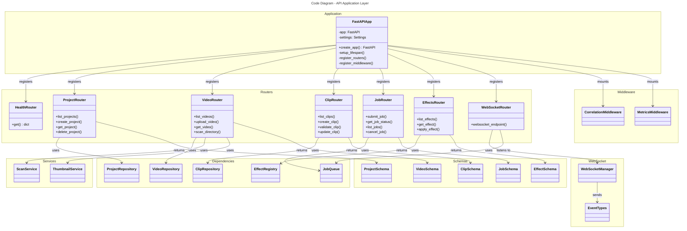

# C4 Code Level: FastAPI Application Layer

## Overview

- **Name**: Python API Application
- **Description**: FastAPI HTTP application providing video editing APIs with routers for effects, videos, clips, jobs, health, and websocket support
- **Location**: src/stoat_ferret/api/
- **Language**: Python (FastAPI, async/await)
- **Purpose**: HTTP/WebSocket endpoint layer orchestrating video processing operations with dependency injection

## Code Elements

### Core Application

#### app (app.py)
- **File**: app.py
- **Type**: FastAPI application factory
- **Key Components**:
  - FastAPI instance creation
  - Lifespan context manager setup
  - Router registration
  - Middleware configuration
  - Settings integration
- **Routers Registered**:
  - `routers.health` - Health check endpoint
  - `routers.projects` - Project management
  - `routers.videos` - Video file operations
  - `routers.clips` - Clip management
  - `routers.jobs` - Job queue operations
  - `routers.effects` - Effect discovery
  - `routers.ws` - WebSocket connection handler
- **Middleware Stack**:
  - Correlation ID tracking (request tracing)
  - Metrics collection
- **Dependencies Injected**:
  - Effect registry
  - Job queue
  - Repository instances
  - Database connections

#### settings (settings.py)
- **Type**: Configuration settings class
- **Purpose**: Environment-based configuration for API
- **Key Settings**: Database URL, job queue settings, effect registry configuration

### Router Modules

#### routers.health (routers/health.py)
- **Function**: `get() -> dict`
- **Endpoint**: GET /health
- **Response**: {"status": "ok", ...}
- **Purpose**: Health check for monitoring

#### routers.projects (routers/projects.py)
- **Endpoints** (inferred):
  - Project CRUD operations
  - Project listing
- **Dependencies**: ProjectRepository
- **Response Types**: ProjectSchema

#### routers.videos (routers/videos.py)
- **Endpoints** (inferred):
  - Video file upload/import
  - Video listing
  - Video metadata retrieval
  - Thumbnail generation
- **Dependencies**: VideoRepository, ThumbnailService
- **Response Types**: VideoSchema

#### routers.clips (routers/clips.py)
- **Endpoints** (inferred):
  - Clip CRUD operations
  - Clip validation
  - Clip timeline operations
- **Dependencies**: ClipRepository, validation functions
- **Response Types**: ClipSchema

#### routers.jobs (routers/jobs.py)
- **Endpoints** (inferred):
  - Job submission to queue
  - Job status queries
  - Job listing
- **Dependencies**: JobQueue
- **Response Types**: JobSchema

#### routers.effects (routers/effects.py)
- **Endpoints** (inferred):
  - List available effects
  - Get effect definition with schema
  - Apply effect to clip
- **Dependencies**: EffectRegistry
- **Response Types**: EffectSchema
- **Path**: GET /api/effects - lists all effects
- **Path**: GET /api/effects/{effect_type} - gets effect with parameter schema

#### routers.ws (routers/ws.py)
- **Protocol**: WebSocket
- **Path**: /ws
- **Purpose**: Real-time job status updates and event broadcasting
- **Dependencies**: WebSocketManager, ConnectionManager
- **Events**: Job started, progress updated, completed, failed

### Schema Modules

#### schemas.video (schemas/video.py)
- **Types**:
  - VideoSchema - Full video metadata
  - VideoListSchema - Video list response
- **Fields**: ID, filename, duration, framerate, resolution, created_at

#### schemas.project (schemas/project.py)
- **Types**:
  - ProjectSchema - Project with metadata
  - ProjectCreateSchema - Input for project creation
- **Fields**: ID, name, description, workspace, created_at

#### schemas.clip (schemas/clip.py)
- **Types**:
  - ClipSchema - Clip with timeline info
  - ClipCreateSchema - Input for clip creation
- **Fields**: ID, video_id, in_point, out_point, duration, project_id

#### schemas.job (schemas/job.py)
- **Types**:
  - JobSchema - Job status and metadata
  - JobCreateSchema - Input for job submission
- **Fields**: ID, type, status, progress, created_at, completed_at, error

#### schemas.effect (schemas/effect.py)
- **Types**:
  - EffectSchema - Effect with definition
  - EffectListSchema - List of available effects
- **Fields**: effect_type, name, description, parameter_schema, ai_hints, preview

### Middleware

#### middleware.correlation (middleware/correlation.py)
- **Purpose**: Adds request correlation IDs for tracing
- **Behavior**: Generates or propagates correlation IDs through request/response

#### middleware.metrics (middleware/metrics.py)
- **Purpose**: Collects API performance metrics
- **Metrics**: Request latency, endpoint hit counts, error rates

### Services

#### services.scan (services/scan.py)
- **Purpose**: Video file scanning and import
- **Functions**: Scan directories for video files, extract metadata

#### services.thumbnail (services/thumbnail.py)
- **Purpose**: Thumbnail generation for video files
- **Functions**: Generate thumbnails at specified timestamps

### WebSocket Support

#### websocket.manager (websocket/manager.py)
- **Class**: WebSocketManager
- **Purpose**: Manages active WebSocket connections
- **Methods**:
  - `connect(websocket)` - Register connection
  - `disconnect(websocket)` - Unregister connection
  - `broadcast(message)` - Send to all connections
  - `send_personal(websocket, message)` - Send to specific connection

#### websocket.events (websocket/events.py)
- **Types**: Event data classes for WebSocket communication
- **Events**: JobStarted, JobProgress, JobCompleted, JobFailed

## Dependencies

### Internal Dependencies
- `stoat_ferret.effects` - EffectRegistry for effect discovery
- `stoat_ferret.db` - Repository classes for data access
- `stoat_ferret.jobs` - JobQueue for async processing
- `stoat_ferret.ffmpeg` - FFmpeg integration layer
- `stoat_ferret.logging` - Structured logging with structlog

### External Dependencies
- **FastAPI** - Web framework
- **Pydantic** - Schema validation and serialization
- **SQLAlchemy** - Database ORM (via repositories)
- **structlog** - Structured logging
- **asyncio** - Async runtime support
- **websockets** - WebSocket protocol support

## Relationships

## Design Patterns

1. **Dependency Injection**: Settings and repositories injected via FastAPI dependency system
2. **Router Pattern**: Modular endpoint organization with separate router files
3. **Schema Validation**: Pydantic schemas for request/response validation
4. **Middleware Stack**: Cross-cutting concerns (tracing, metrics) via middleware
5. **WebSocket Manager**: Connection pool management for real-time updates
6. **Service Layer**: Business logic separated from HTTP handlers

## Async Architecture

- All endpoints use `async def` for non-blocking I/O
- Database operations via async repositories
- Job queue integrated with async task runners
- WebSocket connections handled asynchronously

## Parent Component

[API Gateway](./c4-component-api-gateway.md)

