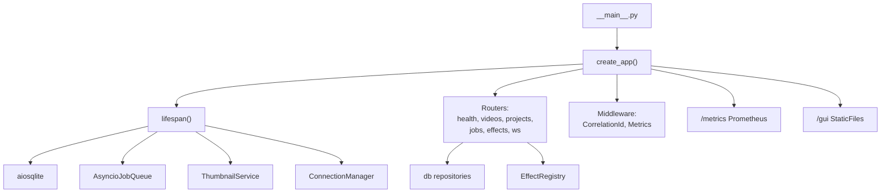

# C4 Code Level: FastAPI Application Layer

> **Note**: The canonical documentation for `src/stoat_ferret/api/` is maintained in
> [c4-code-stoat-ferret-api.md](./c4-code-stoat-ferret-api.md). This file is a secondary
> reference providing an alternate view of the same directory.

## Overview
- **Name**: Python API Application
- **Description**: FastAPI HTTP application providing video editing APIs with routers for effects, videos, clips, jobs, health, and WebSocket support.
- **Location**: `src/stoat_ferret/api/`
- **Language**: Python (FastAPI, async/await)
- **Purpose**: HTTP/WebSocket endpoint layer orchestrating video processing operations with dependency injection.
- **Parent Component**: TBD

## Code Elements

### Core Application (app.py)

- `lifespan(app: FastAPI) -> AsyncGenerator[None, None]` -- Manages startup/shutdown: opens DB, starts job worker, creates ConnectionManager.
- `create_app(*, video_repository, project_repository, clip_repository, job_queue, ws_manager, effect_registry, gui_static_path) -> FastAPI` -- Application factory with DI support for testing.

### Settings (settings.py)

- `Settings(BaseSettings)` -- Environment-based configuration with STOAT_ prefix. Fields: database_path, api_host, api_port, debug, log_level, thumbnail_dir, gui_static_path, ws_heartbeat_interval, allowed_scan_roots.
- `get_settings() -> Settings` -- Cached singleton settings loader.

### Entry Point (__main__.py)

- `main() -> None` -- Runs uvicorn server with configured host/port.

### Routers Registered
- `health` -- GET /health/live, GET /health/ready
- `videos` -- GET/POST/DELETE /api/v1/videos, GET /api/v1/videos/search, POST /api/v1/videos/scan
- `projects` -- GET/POST/DELETE /api/v1/projects, clip CRUD under projects
- `jobs` -- GET /api/v1/jobs/{job_id}
- `effects` -- GET /api/v1/effects, POST /api/v1/effects/preview, CRUD under clips
- `ws` -- WebSocket /ws endpoint

### Middleware Stack
- `CorrelationIdMiddleware` -- Request tracing with correlation IDs
- `MetricsMiddleware` -- Prometheus metrics collection

### Sub-packages
- `services/` -- scan handler, ThumbnailService
- `websocket/` -- ConnectionManager, event types
- `middleware/` -- correlation ID, metrics
- `routers/` -- endpoint handlers
- `schemas/` -- Pydantic request/response models

## Dependencies

### Internal Dependencies
- `stoat_ferret.effects` -- EffectRegistry
- `stoat_ferret.db` -- Repository protocols and implementations
- `stoat_ferret.jobs` -- AsyncioJobQueue
- `stoat_ferret.ffmpeg` -- RealFFmpegExecutor

### External Dependencies
- `fastapi` -- Web framework
- `pydantic` / `pydantic_settings` -- Schema validation and settings
- `aiosqlite` -- Async SQLite
- `structlog` -- Structured logging
- `uvicorn` -- ASGI server
- `prometheus_client` -- Metrics endpoint

## Relationships

