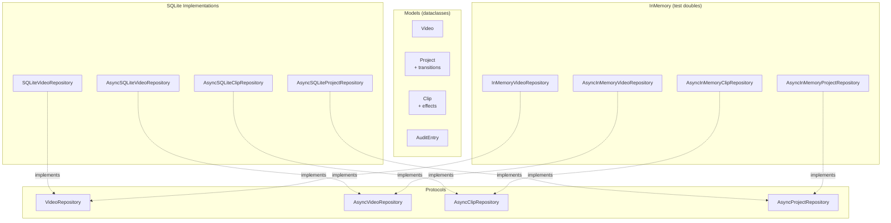

# C4 Code Level: Database Layer and Repositories

> **Note**: The canonical documentation for `src/stoat_ferret/db/` is maintained in
> [c4-code-stoat-ferret-db.md](./c4-code-stoat-ferret-db.md). This file is a secondary
> reference providing an alternate view of the same directory.

## Overview

- **Name**: Database Models and Repository Pattern
- **Description**: Python dataclass models and Protocol-based repository classes for data persistence with raw sqlite3/aiosqlite
- **Location**: `src/stoat_ferret/db/`
- **Language**: Python (sqlite3, aiosqlite -- no ORM)
- **Purpose**: Data access layer abstracting database operations for projects, videos, clips, and audit logging
- **Parent Component**: TBD

## Code Elements

### Database Models (models.py) -- Python dataclasses

- **Video** (dataclass) -- id: str, path, filename, duration_frames, frame_rate_numerator, frame_rate_denominator, width, height, video_codec, file_size, created_at, updated_at, audio_codec?, thumbnail_path?
  - Properties: `frame_rate -> float`, `duration_seconds -> float`

- **Project** (dataclass) -- id: str, name, output_width, output_height, output_fps, created_at, updated_at, transitions? (list[dict])

- **Clip** (dataclass) -- id: str, project_id, source_video_id, in_point, out_point, timeline_position, created_at, updated_at, effects? (list[dict])
  - Method: `validate(source_path, source_duration_frames)` -- delegates to Rust core

- **AuditEntry** (dataclass) -- id: str, timestamp, operation, entity_type, entity_id, changes_json?, context?

- **ClipValidationError** (Exception) -- wraps Rust validation errors with field, message, actual, expected

### Repository Pattern -- Protocol-based interfaces (no base class inheritance)

**Sync Repositories** (repository.py):
- `VideoRepository(Protocol)` -- add, get, get_by_path, list_videos, search, update, delete
- `SQLiteVideoRepository` -- Raw SQL with FTS5 for search
- `InMemoryVideoRepository` -- Dict-based with token prefix matching for search

**Async Repositories** (async_repository.py, clip_repository.py, project_repository.py):
- `AsyncVideoRepository(Protocol)` -- add, get, get_by_path, list_videos, search, update, count, delete
- `AsyncClipRepository(Protocol)` -- add, get, list_by_project, update, delete
- `AsyncProjectRepository(Protocol)` -- add, get, list_projects, update, delete
- Each Protocol has SQLite and InMemory implementations

### Schema (schema.py)
- `create_tables(conn)` -- DDL for videos, projects, clips, audit_log, videos_fts (FTS5), triggers, indexes

### Audit (audit.py)
- `AuditLogger` -- log_change, get_history for tracking data modifications

## Dependencies

### Internal Dependencies
- `stoat_ferret_core` -- Clip, Position, Duration, validate_clip for Rust-based clip validation

### External Dependencies
- `sqlite3` -- Sync database operations (raw SQL, no ORM)
- `aiosqlite` -- Async database operations (raw SQL)
- `json` -- Serialization for audit changes, effects, transitions
- `copy` -- Deep copy for in-memory repository isolation
- `re` -- Token splitting for in-memory search

## Relationships

