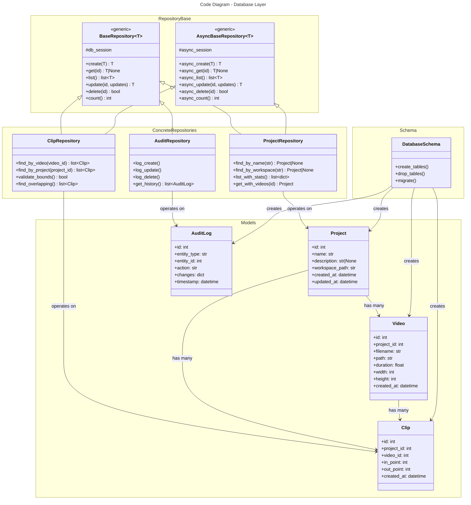

# C4 Code Level: Database Layer and Repositories

## Overview

- **Name**: Database Models and Repository Pattern
- **Description**: SQLAlchemy ORM models and repository classes for data persistence with async support
- **Location**: src/stoat_ferret/db/
- **Language**: Python (SQLAlchemy 2.0, async)
- **Purpose**: Data access layer abstracting database operations for projects, videos, and clips

## Code Elements

### Database Models (models.py)

**Model Classes** (SQLAlchemy ORM)
- **Project**
  - `id: int` (Primary Key)
  - `name: str` - Project name
  - `description: str | None` - Optional description
  - `workspace_path: str` - Root directory for project files
  - `created_at: datetime` - Creation timestamp
  - `updated_at: datetime` - Last update timestamp
  - **Relationships**: One-to-many with Video, Clip

- **Video**
  - `id: int` (Primary Key)
  - `project_id: int` (Foreign Key to Project)
  - `filename: str` - Original filename
  - `path: str` - Full file path
  - `duration: float` - Duration in seconds
  - `framerate_num: int` - Frame rate numerator
  - `framerate_den: int` - Frame rate denominator
  - `width: int` - Video width in pixels
  - `height: int` - Video height in pixels
  - `created_at: datetime` - Creation timestamp
  - **Relationships**: Many-to-one with Project, One-to-many with Clip

- **Clip**
  - `id: int` (Primary Key)
  - `project_id: int` (Foreign Key to Project)
  - `video_id: int` (Foreign Key to Video)
  - `in_point: int` - Start frame (inclusive)
  - `out_point: int` - End frame (exclusive)
  - `created_at: datetime` - Creation timestamp
  - **Relationships**: Many-to-one with Project and Video

### Schema (schema.py)

**Database initialization and table definitions**
- Table creation DDL
- Index definitions
- Schema version management

### Base Repository (repository.py)

**BaseRepository[T]** - Generic repository base class
- **Purpose**: Common CRUD operations for all entity types
- **Type Parameter**: T - Entity model class
- **Methods**:
  - `create(entity: T) -> T` - Insert new record
  - `get(id: int) -> T | None` - Fetch by ID
  - `list(skip: int = 0, limit: int = 100) -> list[T]` - Paginated listing
  - `update(id: int, updates: dict) -> T` - Update record
  - `delete(id: int) -> bool` - Delete record
  - `count() -> int` - Total record count
- **Transactions**: Implicit transaction management

### Async Repository (async_repository.py)

**AsyncBaseRepository[T]** - Async variant of BaseRepository
- **Purpose**: Non-blocking database access for async endpoints
- **Methods**: Same as BaseRepository but `async def` signature
  - `async create(entity: T) -> T`
  - `async get(id: int) -> T | None`
  - `async list(skip: int = 0, limit: int = 100) -> list[T]`
  - `async update(id: int, updates: dict) -> T`
  - `async delete(id: int) -> bool`
  - `async count() -> int`
- **Session Management**: Uses SQLAlchemy async sessions with `async with`

### Concrete Repositories

#### ProjectRepository (project_repository.py)
- **Extends**: BaseRepository[Project] or AsyncBaseRepository[Project]
- **Specialized Methods**:
  - `find_by_name(name: str) -> Project | None` - Lookup by project name
  - `find_by_workspace(path: str) -> Project | None` - Lookup by workspace path
  - `list_with_stats() -> list[dict]` - Projects with video/clip counts
  - `get_with_videos(id: int) -> Project` - Eager load related videos

#### ClipRepository (clip_repository.py)
- **Extends**: BaseRepository[Clip] or AsyncBaseRepository[Clip]
- **Specialized Methods**:
  - `find_by_video(video_id: int) -> list[Clip]` - Clips in specific video
  - `find_by_project(project_id: int) -> list[Clip]` - Clips in project
  - `validate_bounds(video_id: int, in_point: int, out_point: int) -> bool` - Boundary check
  - `find_overlapping(video_id: int, in_point: int, out_point: int) -> list[Clip]` - Overlap detection

### Database Module Init (__init__.py)

**Exports**:
- Session factory for database connections
- Repository instances
- Model classes
- Schema initialization functions

### Audit Log (audit.py)

**AuditLog** - Entity for tracking changes
- `id: int` (Primary Key)
- `entity_type: str` - Type being modified (project, video, clip)
- `entity_id: int` - ID of entity
- `action: str` - CREATE, UPDATE, DELETE
- `changes: dict` - Field changes in JSON
- `user_id: str | None` - User who made change
- `timestamp: datetime` - When change occurred

**AuditRepository** - Specialized repository for audit logs
- `log_create(entity_type: str, entity_id: int, user_id: str | None)`
- `log_update(entity_type: str, entity_id: int, changes: dict, user_id: str | None)`
- `log_delete(entity_type: str, entity_id: int, user_id: str | None)`
- `get_history(entity_type: str, entity_id: int) -> list[AuditLog]`

## Dependencies

### Internal Dependencies
- Database configuration from settings
- ORM session factory setup

### External Dependencies
- **SQLAlchemy** - ORM and database abstraction (v2.0)
- **sqlalchemy.ext.asyncio** - Async session support
- **datetime** - Timestamp fields
- **typing** - Type hints (Generic, TypeVar, etc.)

## Database Configuration

**Connection Settings**:
- DATABASE_URL environment variable
- Supports PostgreSQL, SQLite, MySQL
- Connection pooling with configurable pool size
- Echo mode for query logging in development

**Async Engine**:
- Create async engine: `create_async_engine()`
- Async session factory: `async_sessionmaker()`
- Connection pooling via AsyncPool

## Repository Pattern Implementation

## Transaction Management

- **Implicit Transactions**: Each repository method is wrapped in transaction
- **Async Context Manager**: `async with session.begin():` for explicit control
- **Rollback on Error**: Automatic rollback if exception occurs
- **Savepoints**: Support for nested transactions via savepoints

## Query Optimization

- **Eager Loading**: `selectinload()` for related objects
- **Lazy Loading**: Default lazy loading for on-demand relationships
- **Pagination**: `skip` and `limit` parameters for list operations
- **Indexing**: Database indexes on foreign keys and frequently queried columns

## Parent Component

[Data Access Layer](./c4-component-data-access.md)

