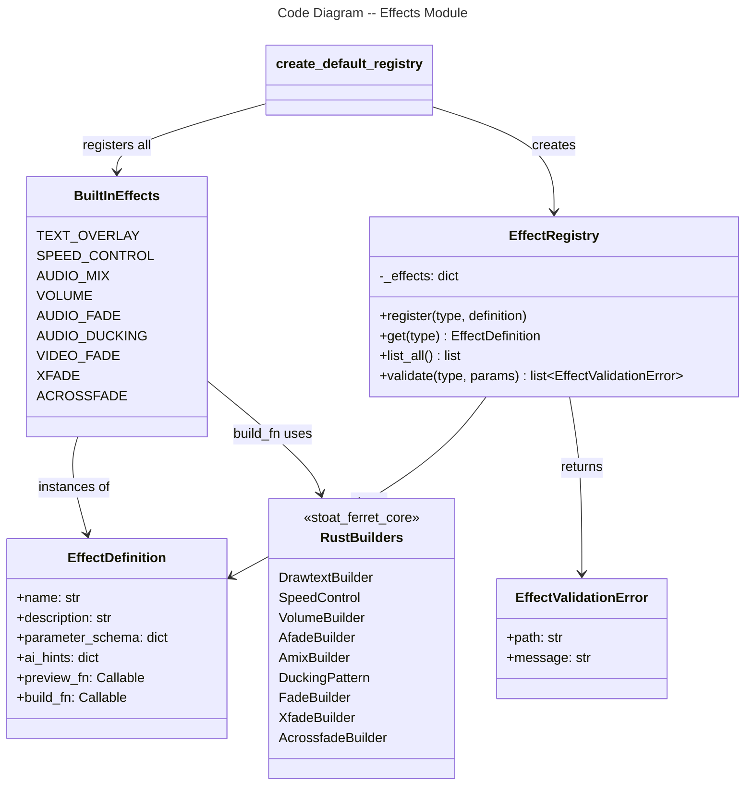

# C4 Code Level: Effects Discovery and Registry

## Overview

- **Name**: Effects System -- Definition, Validation, and Discovery
- **Description**: Python module for defining, registering, validating, and describing effects with JSON schemas and AI hints
- **Location**: `src/stoat_ferret/effects/`
- **Language**: Python
- **Purpose**: Provides 9 built-in effect definitions with parameter schemas, AI hints, build functions, and preview functions, plus a registry for effect discovery and JSON schema validation
- **Parent Component**: TBD

## Code Elements

### Classes/Modules

#### EffectDefinition (definitions.py)
- **Type**: dataclass (frozen)
- **Location**: `src/stoat_ferret/effects/definitions.py:27`
- **Attributes**:
  - `name: str` -- Human-readable effect name
  - `description: str` -- What the effect does
  - `parameter_schema: dict[str, object]` -- JSON Schema describing parameters
  - `ai_hints: dict[str, str]` -- Map of parameter names to AI guidance strings
  - `preview_fn: Callable[[], str]` -- Function returning filter preview string
  - `build_fn: Callable[[dict[str, Any]], str]` -- Function receiving params, returning filter string

#### EffectValidationError (registry.py)
- **Type**: Class
- **Location**: `src/stoat_ferret/effects/registry.py:15`
- **Attributes**: `path: str`, `message: str`
- **Purpose**: Structured validation error from JSON schema validation

#### EffectRegistry (registry.py)
- **Type**: Class
- **Location**: `src/stoat_ferret/effects/registry.py:31`
- **Methods**:
  - `__init__() -> None` -- Creates empty registry
  - `register(effect_type: str, definition: EffectDefinition) -> None` -- Registers effect by type
  - `get(effect_type: str) -> EffectDefinition | None` -- Retrieves effect definition
  - `list_all() -> list[tuple[str, EffectDefinition]]` -- Lists all registered effects
  - `validate(effect_type: str, parameters: dict) -> list[EffectValidationError]` -- Validate params via JSON schema
- **Dependencies**: `jsonschema.Draft7Validator`, `structlog`

### Functions

#### create_default_registry() (definitions.py:702)
- **Signature**: `def create_default_registry() -> EffectRegistry`
- **Return**: New EffectRegistry with all 9 built-in effects registered

### Built-in Effects (9 total)

| Constant | Name | Builder | Required Params |
|----------|------|---------|-----------------|
| `TEXT_OVERLAY` | Text Overlay | `DrawtextBuilder` | text |
| `SPEED_CONTROL` | Speed Control | `SpeedControl` | factor |
| `AUDIO_MIX` | Audio Mix | `AmixBuilder` | inputs |
| `VOLUME` | Volume | `VolumeBuilder` | volume |
| `AUDIO_FADE` | Audio Fade | `AfadeBuilder` | fade_type, duration |
| `AUDIO_DUCKING` | Audio Ducking | `DuckingPattern` | (all optional) |
| `VIDEO_FADE` | Video Fade | `FadeBuilder` | fade_type, duration |
| `XFADE` | Crossfade (Video) | `XfadeBuilder` | transition, duration, offset |
| `ACROSSFADE` | Crossfade (Audio) | `AcrossfadeBuilder` | duration |

Each effect has a `_build_*` function (receives parameters dict, returns filter string) and a `_*_preview` function (returns filter string with default parameters).

## Dependencies

### Internal Dependencies
- `stoat_ferret_core.DrawtextBuilder` -- Text overlay filter generation
- `stoat_ferret_core.SpeedControl` -- Speed adjustment filter generation
- `stoat_ferret_core.VolumeBuilder` -- Volume filter generation
- `stoat_ferret_core.AfadeBuilder` -- Audio fade filter generation
- `stoat_ferret_core.AmixBuilder` -- Audio mix filter generation
- `stoat_ferret_core.DuckingPattern` -- Sidechain compression filter generation
- `stoat_ferret_core.FadeBuilder` -- Video fade filter generation
- `stoat_ferret_core.TransitionType` -- Transition type enum
- `stoat_ferret_core.XfadeBuilder` -- Video crossfade filter generation
- `stoat_ferret_core.AcrossfadeBuilder` -- Audio crossfade filter generation

### External Dependencies
- `dataclasses` -- dataclass decorator for EffectDefinition
- `collections.abc.Callable` -- Type hint for preview and build functions
- `jsonschema` -- Draft7Validator for parameter validation in EffectRegistry
- `structlog` -- Structured logging in EffectRegistry

## Relationships

