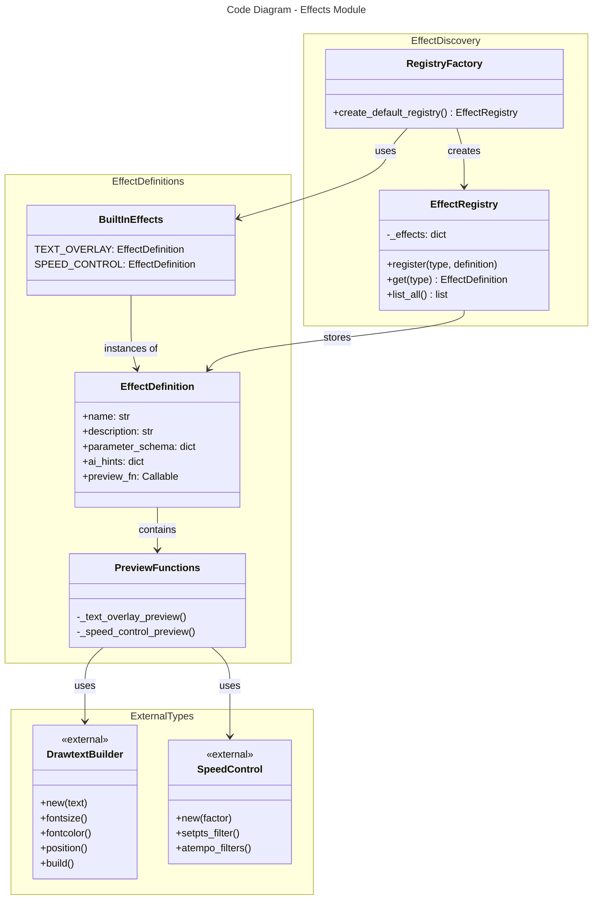

# C4 Code Level: Effects Discovery and Registry

## Overview

- **Name**: Effects System - Definition and Discovery
- **Description**: Python module for discovering, registering, and describing effects with JSON schemas and AI hints
- **Location**: src/stoat_ferret/effects/
- **Language**: Python
- **Purpose**: Provides effect definitions with parameter schemas and enables AI-driven effect parameter generation

## Code Elements

### Classes/Modules

#### EffectDefinition (definitions.py)
- **File**: definitions.py:15-32
- **Type**: dataclass (frozen)
- **Purpose**: Immutable definition of an available effect
- **Attributes**:
  - `name: str` - Human-readable effect name
  - `description: str` - What the effect does
  - `parameter_schema: dict[str, object]` - JSON Schema describing parameters
  - `ai_hints: dict[str, str]` - Map of parameter names to AI guidance strings
  - `preview_fn: Callable[[], str]` - Function returning filter preview string
- **Key Built-in Effects**:
  - `TEXT_OVERLAY` - Text overlay with positioning and styling
  - `SPEED_CONTROL` - Video/audio speed adjustment

#### EffectRegistry (registry.py)
- **File**: registry.py:12-49
- **Type**: Class
- **Purpose**: Registry pattern for discovered effects
- **Methods**:
  - `__init__() -> None` - Creates empty registry
  - `register(effect_type: str, definition: EffectDefinition) -> None` - Registers effect by type
  - `get(effect_type: str) -> EffectDefinition | None` - Retrieves effect definition
  - `list_all() -> list[tuple[str, EffectDefinition]]` - Lists all registered effects
- **Logging**: Uses structlog to log effect registration events
- **Pattern Reference**: Follows register_handler() pattern from job queue (LRN-009)

### Functions

#### _text_overlay_preview() (definitions.py:35-44)
- **Signature**: `def _text_overlay_preview() -> str`
- **Return**: FFmpeg drawtext filter string with default parameters
- **Implementation**:
  ```
  DrawtextBuilder("Sample Text")
    .fontsize(48)
    .fontcolor("white")
    .position("bottom_center", margin=20)
    .build()
  ```
- **Purpose**: Generates preview for TEXT_OVERLAY effect

#### _speed_control_preview() (definitions.py:47-54)
- **Signature**: `def _speed_control_preview() -> str`
- **Return**: FFmpeg setpts and atempo filter string with 2.0x speed
- **Implementation**: Uses SpeedControl(2.0) to generate video and audio filters
- **Purpose**: Generates preview for SPEED_CONTROL effect

#### create_default_registry() (definitions.py:141-151)
- **Signature**: `def create_default_registry() -> EffectRegistry`
- **Return**: New EffectRegistry with text_overlay and speed_control registered
- **Implementation**:
  ```
  registry = EffectRegistry()
  registry.register("text_overlay", TEXT_OVERLAY)
  registry.register("speed_control", SPEED_CONTROL)
  return registry
  ```
- **Purpose**: Factory function for default effect discovery

## Schema and Hints Reference

### TEXT_OVERLAY Effect (definitions.py:57-108)

**Parameter Schema**:
- `text` (string, required) - Text to display
- `fontsize` (integer, default: 48) - Font size in pixels
- `fontcolor` (string, default: "white") - Color name or hex
- `position` (enum, default: "bottom_center") - Placement preset
- `margin` (integer, default: 10) - Edge margin in pixels
- `font` (string, optional) - Fontconfig font name

**AI Hints**:
- `text`: "The text content to overlay on the video"
- `fontsize`: "Font size in pixels, typical range 12-72"
- `fontcolor`: "Color name (white, yellow) or hex (#FF0000), append @0.5 for transparency"
- `position`: "Where to place the text on screen"
- `margin`: "Distance from screen edge in pixels, typical range 5-50"
- `font`: "Fontconfig font name (e.g., 'monospace', 'Sans', 'Serif')"

### SPEED_CONTROL Effect (definitions.py:110-138)

**Parameter Schema**:
- `factor` (number, required, range: 0.25-4.0, default: 2.0) - Speed multiplier
- `drop_audio` (boolean, default: false) - Skip audio speed adjustment

**AI Hints**:
- `factor`: "Speed multiplier: 0.25-4.0. Values <1 slow down, >1 speed up. 2.0 = double speed"
- `drop_audio`: "Set true for timelapse effects where audio is not needed"

## Dependencies

### Internal Dependencies
- `stoat_ferret_core.DrawtextBuilder` - For text overlay preview generation
- `stoat_ferret_core.SpeedControl` - For speed control preview generation
- Type hints: uses `TYPE_CHECKING` guard for circular import prevention

### External Dependencies
- `dataclasses` - dataclass decorator for EffectDefinition
- `collections.abc.Callable` - Type hint for preview function
- `typing.TYPE_CHECKING` - Conditional imports for type annotations
- `structlog` - Structured logging in EffectRegistry

## Relationships



## Design Patterns

1. **Registry Pattern**: EffectRegistry provides dynamic effect discovery
2. **Dataclass**: EffectDefinition uses frozen dataclass for immutability
3. **Factory Pattern**: create_default_registry() bootstraps the registry
4. **Type Hints with TYPE_CHECKING**: Avoids circular imports while maintaining type safety
5. **Callable Types**: preview_fn enables lazy evaluation of filter previews

## AI Integration Points

- JSON Schema parameter_schema enables AI model understanding of effect structure
- ai_hints dictionary provides semantic guidance for parameter values
- preview_fn callable allows AI to see example output format
- This design supports AI-driven effect parameter generation (mentioned in requirements)

## Parent Component

TBD

