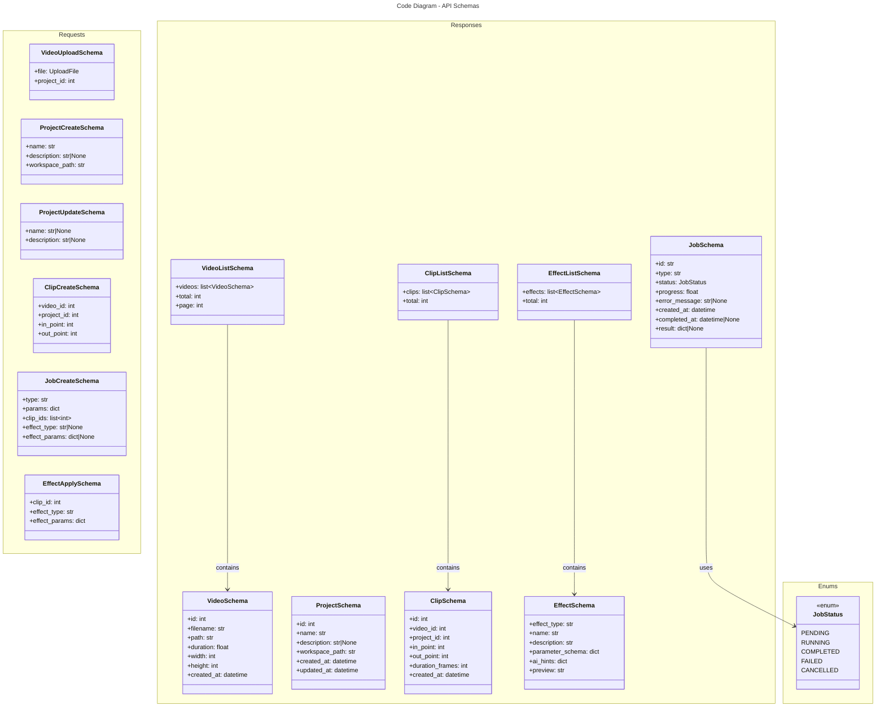

# C4 Code Level: API Request/Response Schemas

## Overview

- **Name**: API Schema Definitions
- **Description**: Pydantic models for request validation and response serialization across all API endpoints
- **Location**: src/stoat_ferret/api/schemas/
- **Language**: Python (Pydantic v2)
- **Purpose**: Type-safe request/response contracts for HTTP API endpoints and data transfer

## Code Elements

### Schema Modules

#### video.py (schemas/video.py)

**VideoSchema** - Full video metadata response
- `id: int` - Database ID
- `filename: str` - Original filename
- `path: str` - Full file path
- `duration: float` - Duration in seconds
- `framerate_num: int` - Numerator of frame rate (e.g., 24000 for 24000/1001)
- `framerate_den: int` - Denominator of frame rate (e.g., 1001 for 23.976fps)
- `width: int` - Video width in pixels
- `height: int` - Video height in pixels
- `created_at: datetime` - Creation timestamp
- **Validators**: Path existence, numeric ranges

**VideoListSchema** - Response for video listing endpoint
- `videos: list[VideoSchema]` - Array of videos
- `total: int` - Total count of videos
- `page: int` - Current page number
- `per_page: int` - Items per page

**VideoUploadSchema** - Request for uploading video
- `file: UploadFile` - Binary video file
- `project_id: int` - Project to assign to

#### project.py (schemas/project.py)

**ProjectSchema** - Full project metadata
- `id: int` - Database ID
- `name: str` - Project name
- `description: str | None` - Optional description
- `workspace_path: str` - Root workspace directory
- `created_at: datetime` - Creation timestamp
- `updated_at: datetime` - Last update timestamp
- **Constraints**: name 1-255 chars, path must exist

**ProjectCreateSchema** - Request to create project
- `name: str` - Project name (required)
- `description: str | None` - Optional description
- `workspace_path: str` - Workspace directory

**ProjectUpdateSchema** - Request to update project
- `name: str | None` - New name
- `description: str | None` - New description

#### clip.py (schemas/clip.py)

**ClipSchema** - Full clip metadata with timeline info
- `id: int` - Database ID
- `video_id: int` - Source video ID
- `project_id: int` - Parent project ID
- `in_point: int` - Start frame (inclusive)
- `out_point: int` - End frame (exclusive)
- `duration_frames: int` - Calculated duration
- `created_at: datetime` - Creation timestamp
- **Validators**: in_point < out_point, in_point >= 0

**ClipCreateSchema** - Request to create clip
- `video_id: int` - Source video (required)
- `project_id: int` - Parent project (required)
- `in_point: int` - Start frame (required)
- `out_point: int` - End frame (required)

**ClipListSchema** - Response for clip listing
- `clips: list[ClipSchema]` - Array of clips
- `total: int` - Total clips in query

#### job.py (schemas/job.py)

**JobSchema** - Job status and result metadata
- `id: str` - UUID job identifier
- `type: str` - Job type (e.g., "transcode", "effect_apply")
- `status: JobStatus` - Current status enum
- `progress: float` - 0.0-1.0 completion percentage
- `error_message: str | None` - Error details if failed
- `created_at: datetime` - Submission timestamp
- `completed_at: datetime | None` - Completion timestamp if done
- `result: dict | None` - Operation result data

**JobStatus** - Enum of job states
- `PENDING` - Queued, waiting to start
- `RUNNING` - Currently executing
- `COMPLETED` - Successfully finished
- `FAILED` - Execution failed
- `CANCELLED` - User cancelled

**JobCreateSchema** - Request to submit job
- `type: str` - Job type identifier (required)
- `params: dict` - Job-specific parameters
- `clip_ids: list[int]` - Clips to operate on
- `effect_type: str | None` - Effect type if applicable
- `effect_params: dict | None` - Effect parameters

#### effect.py (schemas/effect.py)

**EffectSchema** - Effect definition with discovery metadata
- `effect_type: str` - Unique effect identifier
- `name: str` - Human-readable name
- `description: str` - What the effect does
- `parameter_schema: dict` - JSON Schema for parameters
- `ai_hints: dict[str, str]` - AI guidance for each parameter
- `preview: str` - Example FFmpeg filter output

**EffectListSchema** - Response for effect listing
- `effects: list[EffectSchema]` - All available effects
- `total: int` - Count of effects

**EffectApplySchema** - Request to apply effect to clip
- `clip_id: int` - Target clip (required)
- `effect_type: str` - Effect identifier (required)
- `effect_params: dict` - Parameter values (required)

## Dependencies

### Internal Dependencies
- `stoat_ferret.effects.definitions` - EffectDefinition for effect schemas
- Database models in `stoat_ferret.db.models` - Mapping to ORM models
- Type definitions from `stoat_ferret_core` - Timeline types

### External Dependencies
- **Pydantic** - Schema validation and serialization (v2)
- **FastAPI** - UploadFile type for file handling
- **datetime** - timestamp fields
- **typing** - Type hints (list, dict, Optional, Union)

## Schema Patterns

### Field Validation
- **Range Validators**: Numeric fields with min/max constraints
- **String Validators**: Length constraints, pattern matching
- **Custom Validators**: Cross-field validation (e.g., in_point < out_point)
- **Enum Validators**: Status/type fields constrained to valid values

### Serialization
- **datetime Serialization**: ISO 8601 format for timestamps
- **Config**: Pydantic ConfigDict with json_schema_extra for OpenAPI docs
- **Aliases**: JSON field names may differ from Python names

### Request/Response Separation
- **Create Schemas**: Only required fields for POST requests
- **Update Schemas**: Optional fields for PATCH requests
- **Response Schemas**: Include generated/computed fields (id, timestamps)

## Relationships

## OpenAPI Integration

All Pydantic schemas automatically integrate with FastAPI's OpenAPI (Swagger) documentation:
- Request body documentation auto-generated from create schemas
- Response documentation from response schemas
- Parameter constraints visible in OpenAPI spec
- Example values from field defaults

## Parent Component

[API Gateway](./c4-component-api-gateway.md)

