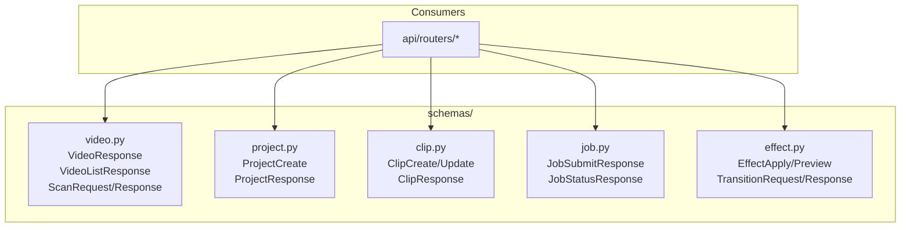

# C4 Code Level: API Request/Response Schemas

> **Note**: The canonical documentation for `src/stoat_ferret/api/schemas/` is maintained in
> [c4-code-stoat-ferret-api-schemas.md](./c4-code-stoat-ferret-api-schemas.md). This file is a
> secondary reference providing an alternate view of the same directory.

## Overview

- **Name**: API Schema Definitions
- **Description**: Pydantic v2 models for request validation and response serialization across all API endpoints
- **Location**: `src/stoat_ferret/api/schemas/`
- **Language**: Python (Pydantic v2)
- **Purpose**: Type-safe request/response contracts for HTTP API endpoints
- **Parent Component**: TBD

## Code Elements

### Schema Modules

#### video.py -- Video metadata schemas
- `VideoResponse(BaseModel)` -- Full video metadata (id: str, path, filename, duration_frames, frame_rate_numerator/denominator, width, height, video_codec, audio_codec, file_size, thumbnail_path, created_at, updated_at)
- `VideoListResponse(BaseModel)` -- Paginated list (videos, total, limit, offset)
- `VideoSearchResponse(BaseModel)` -- Search results (videos, total, query)
- `ScanRequest(BaseModel)` -- Scan params (path, recursive)
- `ScanError(BaseModel)` -- Individual file error (path, error)
- `ScanResponse(BaseModel)` -- Scan results (scanned, new, updated, skipped, errors)

#### project.py -- Project schemas
- `ProjectCreate(BaseModel)` -- Create request (name, output_width, output_height, output_fps)
- `ProjectResponse(BaseModel)` -- Full project (id, name, output_width, output_height, output_fps, created_at, updated_at)
- `ProjectListResponse(BaseModel)` -- List (projects, total)

#### clip.py -- Clip schemas
- `ClipCreate(BaseModel)` -- Create request (source_video_id, in_point, out_point, timeline_position)
- `ClipUpdate(BaseModel)` -- Partial update (in_point?, out_point?, timeline_position?)
- `ClipResponse(BaseModel)` -- Full clip (id, project_id, source_video_id, in_point, out_point, timeline_position, created_at, updated_at)
- `ClipListResponse(BaseModel)` -- List (clips, total)

#### job.py -- Job schemas
- `JobSubmitResponse(BaseModel)` -- Job submission ack (job_id)
- `JobStatusResponse(BaseModel)` -- Status query (job_id, status, progress, result, error)

#### effect.py -- Effect and transition schemas
- `EffectResponse(BaseModel)` -- Discovery response (effect_type, name, description, parameter_schema, ai_hints, filter_preview)
- `EffectListResponse(BaseModel)` -- List (effects, total)
- `EffectApplyRequest(BaseModel)` -- Apply request (effect_type, parameters)
- `EffectApplyResponse(BaseModel)` -- Apply response (effect_type, parameters, filter_string)
- `EffectPreviewRequest(BaseModel)` -- Preview request (effect_type, parameters)
- `EffectPreviewResponse(BaseModel)` -- Preview response (effect_type, filter_string)
- `EffectUpdateRequest(BaseModel)` -- Update at index (parameters)
- `EffectDeleteResponse(BaseModel)` -- Delete response (index, deleted_effect_type)
- `TransitionRequest(BaseModel)` -- Transition request (source_clip_id, target_clip_id, transition_type, parameters)
- `TransitionResponse(BaseModel)` -- Transition response (source_clip_id, target_clip_id, transition_type, parameters, filter_string)

## Dependencies

### Internal Dependencies
- None (leaf module -- schemas have no internal dependencies)

### External Dependencies
- `pydantic` -- BaseModel, ConfigDict, Field (validation and serialization)
- `datetime` -- Timestamp type annotations
- `typing` -- Any

## Relationships

