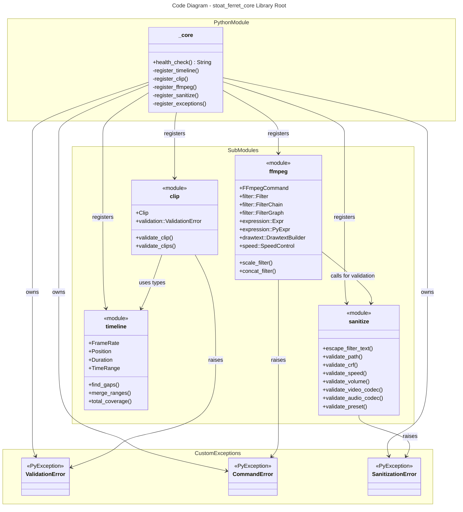

# C4 Code Level: Core Rust Foundation (stoat_ferret_core Library)

## Overview

- **Name**: Rust Core Library Root
- **Description**: Entry point module exposing all Rust computation types and functions to Python via PyO3
- **Location**: rust/stoat_ferret_core/src/lib.rs
- **Language**: Rust
- **Purpose**: PyO3 module registration and custom exception definitions for the video editor's compute kernel

## Code Elements

### Modules

#### timeline (::timeline)
- **File**: timeline/mod.rs
- **Purpose**: Frame-accurate timeline mathematics
- **Exports**:
  - `FrameRate` - Rational frame rate representation
  - `Position` - Frame position type
  - `Duration` - Frame duration type
  - `TimeRange` - Time range with overlap detection
  - Functions: `find_gaps()`, `merge_ranges()`, `total_coverage()`
  - Python functions: `py_find_gaps()`, `py_merge_ranges()`, `py_total_coverage()`

#### clip (::clip)
- **File**: clip/mod.rs
- **Purpose**: Video clip representation and validation
- **Exports**:
  - `Clip` - Struct representing a video clip segment
  - `validation` - Submodule with validation logic
  - `validation::ValidationError` - Custom validation error type
  - Functions: `py_validate_clip()`, `py_validate_clips()`

#### ffmpeg (::ffmpeg)
- **File**: ffmpeg/mod.rs
- **Purpose**: FFmpeg command building and filter graph construction
- **Exports**:
  - `FFmpegCommand` - Command builder
  - `filter` - Submodule with Filter, FilterChain, FilterGraph
  - `expression` - Submodule with Expr and PyExpr
  - `drawtext` - Submodule with DrawtextBuilder
  - `speed` - Submodule with SpeedControl

#### sanitize (::sanitize)
- **File**: sanitize/mod.rs
- **Purpose**: Input validation and sanitization for FFmpeg commands
- **Exports**:
  - Functions: `py_escape_filter_text()`, `py_validate_path()`, `py_validate_crf()`, `py_validate_speed()`, `py_validate_volume()`, `py_validate_video_codec()`, `py_validate_audio_codec()`, `py_validate_preset()`

### Custom Exceptions

#### ValidationError
- **File**: lib.rs:22-26
- **Purpose**: Domain-specific exception for input validation failures
- **Python Base Class**: PyException
- **Usage**: Raised by clip validation functions

#### CommandError
- **File**: lib.rs:27-31
- **Purpose**: Domain-specific exception for FFmpeg command building failures
- **Python Base Class**: PyException
- **Usage**: Raised by FFmpegCommand and filter graph validation

#### SanitizationError
- **File**: lib.rs:32-36
- **Purpose**: Domain-specific exception for sanitization failures
- **Python Base Class**: PyException
- **Usage**: Raised by sanitize module functions

### Module Registration

#### _core (PyModule)
- **File**: lib.rs:48-108
- **Purpose**: PyO3 module entry point that registers all Rust types and functions
- **Python Name**: stoat_ferret_core._core
- **Registration Steps**:
  1. Module function: `health_check()`
  2. Timeline classes: FrameRate, Position, Duration, TimeRange
  3. Timeline functions: py_find_gaps, py_merge_ranges, py_total_coverage
  4. Clip classes: Clip, ValidationError
  5. Clip functions: py_validate_clip, py_validate_clips
  6. FFmpeg classes: FFmpegCommand, Filter, FilterChain, FilterGraph, PyExpr, DrawtextBuilder, SpeedControl
  7. FFmpeg functions: py_scale_filter, py_concat_filter
  8. Sanitize functions: py_escape_filter_text, py_validate_path, py_validate_crf, py_validate_speed, py_validate_volume, py_validate_video_codec, py_validate_audio_codec, py_validate_preset
  9. Custom exceptions: ValidationError, CommandError, SanitizationError

### Functions

#### health_check()
- **File**: lib.rs:38-45
- **Signature**: `fn health_check() -> String`
- **Return**: "stoat_ferret_core OK"
- **Purpose**: Health check endpoint to verify module loads correctly
- **Python Name**: health_check()

## Dependencies

### Internal Dependencies (Cross-Module)
- All modules depend on pyo3 for Python integration
- ffmpeg module depends on sanitize module validation
- clip module depends on timeline module types

### External Dependencies
- **pyo3** - FFI and Python bindings
- **pyo3_stub_gen** - Type stub generation
- **proptest** - Property-based testing (in tests)
- **structlog** - Structured logging (used in some submodules)
- Standard library: std collections, std fmt, std ops, std sync

## Relationships

## Architecture Patterns

- **Layered Design**: Foundational types (timeline) → domain types (clip) → application builders (ffmpeg)
- **PyO3 Registration**: Central module registration enables Python import: `from stoat_ferret_core import *`
- **Custom Exceptions**: Domain-specific error types provide semantic clarity to Python callers
- **Submodule Structure**: Each computational domain (timeline, clip, ffmpeg, sanitize) has separate namespace

## Parent Component

TBD

