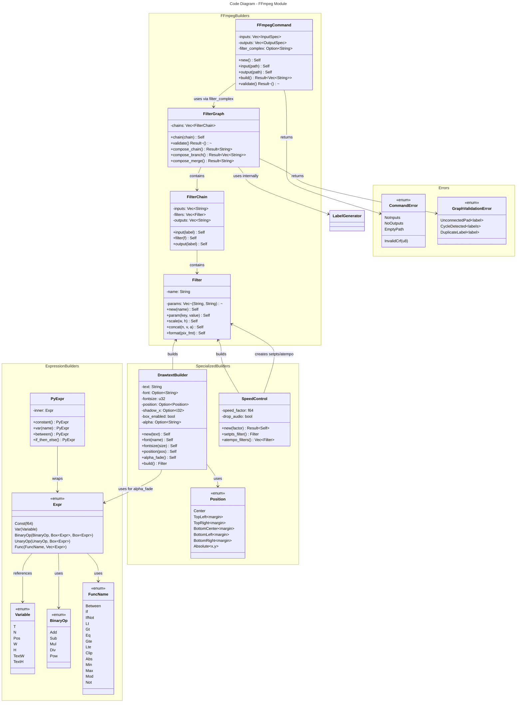

# C4 Code Level: FFmpeg Command Building and Filters

## Overview

- **Name**: FFmpeg Command and Filter Building System
- **Description**: Rust-based type-safe builders for constructing FFmpeg commands, filter chains, and specialized filters for video processing
- **Location**: rust/stoat_ferret_core/src/ffmpeg/
- **Language**: Rust (with PyO3 bindings to Python)
- **Purpose**: Provides domain-specific APIs for building valid FFmpeg commands and complex filter graphs without shell escaping issues

## Code Elements

### Core Types

#### FFmpegCommand
- **File**: command.rs:38-795
- **Purpose**: Type-safe builder for constructing FFmpeg argument arrays
- **Key Methods**:
  - `new() -> Self` - Creates empty builder
  - `input(path: impl Into<String>) -> Self` - Adds input file
  - `output(path: impl Into<String>) -> Self` - Adds output file
  - `seek(seconds: f64) -> Self` - Sets seek position for current input
  - `duration(seconds: f64) -> Self` - Sets duration limit for current input
  - `stream_loop(count: i32) -> Self` - Sets loop count for current input
  - `video_codec(codec: impl Into<String>) -> Self` - Sets video codec
  - `audio_codec(codec: impl Into<String>) -> Self` - Sets audio codec
  - `preset(preset: impl Into<String>) -> Self` - Sets encoding preset
  - `crf(crf: u8) -> Self` - Sets quality level (0-51)
  - `format(format: impl Into<String>) -> Self` - Sets output format
  - `filter_complex(filter: impl Into<String>) -> Self` - Sets filter graph
  - `map(stream: impl Into<String>) -> Self` - Adds stream mapping
  - `build() -> Result<Vec<String>, CommandError>` - Validates and builds arguments
- **Validation Rules**:
  - At least one input required
  - At least one output required
  - CRF value must be 0-51
  - Paths cannot be empty

#### CommandError
- **File**: command.rs:71-96
- **Purpose**: Enumeration of validation errors
- **Variants**:
  - `NoInputs` - Missing input files
  - `NoOutputs` - Missing output files
  - `EmptyPath` - Empty file path
  - `InvalidCrf(u8)` - CRF out of range

#### Filter
- **File**: filter.rs:139-281
- **Purpose**: Single FFmpeg filter with named parameters
- **Key Methods**:
  - `new(name: impl Into<String>) -> Self` - Creates filter with name
  - `param(key: impl Into<String>, value: impl ToString) -> Self` - Adds parameter
  - `scale(width: i32, height: i32) -> Self` - Creates scale filter (static method)
  - `scale_fit(width: i32, height: i32) -> Self` - Creates aspect-ratio-preserving scale
  - `concat(n: usize, v: usize, a: usize) -> Self` - Creates concat filter
  - `pad(width: i32, height: i32, color: String) -> Self` - Creates padding filter
  - `format(pix_fmt: String) -> Self` - Creates format conversion filter
- **Serialization**: `Display` trait produces `name=key1=value1:key2=value2` format

#### FilterChain
- **File**: filter.rs:433-588
- **Purpose**: Sequence of filters connected with commas, with optional input/output labels
- **Key Methods**:
  - `new() -> Self` - Creates empty chain
  - `input(label: impl Into<String>) -> Self` - Adds input label `[label]`
  - `filter(f: Filter) -> Self` - Adds filter to chain
  - `output(label: impl Into<String>) -> Self` - Adds output label `[label]`
- **Serialization**: `[input1][input2]filter1,filter2[output1][output2]` format

#### FilterGraph
- **File**: filter.rs:625-1076
- **Purpose**: Multiple filter chains connected with semicolons, includes validation
- **Key Methods**:
  - `new() -> Self` - Creates empty graph
  - `chain(chain: FilterChain) -> Self` - Adds filter chain
  - `validate() -> Result<(), Vec<GraphValidationError>>` - Validates graph structure
  - `validated_to_string() -> Result<String, Vec<GraphValidationError>>` - Validates then serializes
  - `compose_chain(input: &str, filters: Vec<Filter>) -> Result<String, String>` - Creates labeled chain
  - `compose_branch(input: &str, count: usize, audio: bool) -> Result<Vec<String>, String>` - Splits stream
  - `compose_merge(inputs: &[&str], merge_filter: Filter) -> Result<String, String>` - Merges streams
- **Validation Checks**:
  - No duplicate output labels
  - All input references match output labels (except stream refs like `0:v`)
  - No cycles (using Kahn's algorithm)

#### GraphValidationError
- **File**: filter.rs:42-90
- **Purpose**: Enumeration of graph validation errors
- **Variants**:
  - `UnconnectedPad { label: String }` - Input reference has no matching output
  - `CycleDetected { labels: Vec<String> }` - Circular dependency in graph
  - `DuplicateLabel { label: String }` - Multiple chains output same label

### Expression Types

#### Expr (Expression Tree)
- **File**: expression.rs:194-259
- **Purpose**: Type-safe FFmpeg filter expression tree for time-based and conditional expressions
- **Variants**:
  - `Const(f64)` - Numeric constant
  - `Var(Variable)` - FFmpeg variable (t, n, w, h, etc.)
  - `BinaryOp(BinaryOp, Box<Expr>, Box<Expr>)` - +, -, *, /, ^ operators
  - `UnaryOp(UnaryOp, Box<Expr>)` - Negation
  - `Func(FuncName, Vec<Expr>)` - Function call
- **Key Methods**:
  - `constant(value: f64) -> Self` - Create constant
  - `var(v: Variable) -> Self` - Create variable reference
  - `negate(operand: Expr) -> Self` - Create negation
  - `between(x: Expr, min: Expr, max: Expr) -> Self` - Create between(x,min,max)
  - `if_then_else(cond: Expr, then: Expr, else: Expr) -> Self` - Create conditional
  - `lt(a: Expr, b: Expr)`, `gt()`, `eq_expr()`, `gte()`, `lte()` - Comparisons
  - `clip(x: Expr, min: Expr, max: Expr)` - Clamping
  - `abs(x: Expr)` - Absolute value
  - `min(a: Expr, b: Expr)`, `max()`, `modulo()`, `not()` - Utility functions
- **Operators**: Implements Add, Sub, Mul, Div, Neg trait overloads for natural expression building
- **Serialization**: Generates valid FFmpeg expression strings with intelligent parenthesization

#### Variable
- **File**: expression.rs:52-95
- **Purpose**: Enumeration of FFmpeg built-in variables
- **Variants**: T (time), N (frame number), Pos (sample position), W/H (width/height), TextW/TextH (drawtext), LineH (drawtext), MainW/MainH (overlay)

#### BinaryOp, UnaryOp, FuncName
- **File**: expression.rs:97-192
- **Purpose**: Supporting enums for operations and functions
- **Functions**: Between, If, IfNot, Lt, Gt, Eq, Gte, Lte, Clip, Abs, Min, Max, Mod, Not

#### PyExpr
- **File**: expression.rs:537-722
- **Purpose**: Python-facing wrapper around Expr expression tree
- **Key Methods**: Mirrors Expr constructors with Python naming conventions

### Specialized Filters

#### DrawtextBuilder
- **File**: drawtext.rs:144-645
- **Purpose**: Type-safe builder for FFmpeg drawtext filters (text overlays)
- **Key Methods**:
  - `new(text: &str) -> Self` - Creates with text (auto-escaped)
  - `font(name: &str) -> Self` - Sets font via fontconfig
  - `fontfile(path: &str) -> Self` - Sets font file directly
  - `fontsize(size: u32) -> Self` - Sets font size in pixels
  - `fontcolor(color: &str) -> Self` - Sets font color
  - `position(pos: Position) -> Self` - Sets position preset
  - `shadow(x_offset: i32, y_offset: i32, color: &str) -> Self` - Adds shadow
  - `box_background(color: &str, borderw: u32) -> Self` - Adds box background
  - `alpha(value: f64) -> Self` - Sets static alpha (0.0-1.0)
  - `alpha_fade(start: f64, fade_in: f64, end: f64, fade_out: f64) -> Self` - Creates fade expression
  - `enable(expr: &str) -> Self` - Sets time-based enable expression
  - `build() -> Filter` - Returns Filter instance
- **Position Enum**: Center, BottomCenter, TopLeft, TopRight, BottomLeft, BottomRight, Absolute {x, y}

#### SpeedControl
- **File**: speed.rs:98-262
- **Purpose**: Type-safe speed adjustment for video and audio
- **Key Methods**:
  - `new(factor: f64) -> Result<Self, String>` - Creates (0.25-4.0 range)
  - `with_drop_audio(drop: bool) -> Self` - Sets audio drop flag
  - `speed_factor() -> f64` - Returns speed multiplier
  - `setpts_filter() -> Filter` - Creates video speed filter using `setpts=(1/speed)*PTS`
  - `atempo_filters() -> Vec<Filter>` - Creates audio filters, chains for speeds outside [0.5, 2.0]
- **Audio Chaining**: Automatically decomposes extreme speeds (e.g., 4.0x becomes two 2.0x filters)

## Dependencies

### Internal Dependencies
- `stoat_ferret_core::sanitize` - Input validation functions (validate_speed)
- FFmpeg modules depend on each other: expression, filter, drawtext, speed
- All modules depend on pyo3 for Python bindings

### External Dependencies
- **pyo3** - Python FFI and bindings
- **pyo3_stub_gen** - Automatic type stub generation
- **proptest** - Property-based testing
- Standard library: std::fmt, std::ops, std::collections, std::sync::atomic

## Relationships

## Code Quality Notes

- **Type Safety**: Heavy use of builder pattern with method chaining and Result types
- **Validation**: GraphValidationError provides detailed structural validation with cycle detection
- **Expression Precedence**: Intelligent parenthesization in Expr::Display avoids unnecessary parens
- **PyO3 Integration**: All public types wrapped with py_ prefixed methods for Python compatibility
- **Testing**: Extensive test coverage including property-based tests with proptest
- **Error Handling**: Custom error types with Display implementations for user-friendly messages

## Parent Component

[Rust Core Engine](./c4-component-rust-core-engine.md)

