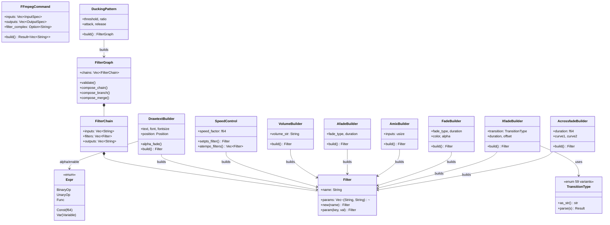

# C4 Code Level: FFmpeg Module

## Overview
- **Name**: FFmpeg Command Builder Module
- **Description**: Type-safe Rust builders for constructing FFmpeg command arguments, filter graphs, expressions, text overlays, speed controls, audio effects, and video/audio transitions
- **Location**: `rust/stoat_ferret_core/src/ffmpeg/`
- **Language**: Rust
- **Purpose**: Provides a safe, validated API for generating FFmpeg CLI commands and complex filter graphs, exposed to Python via PyO3 bindings
- **Parent Component**: [Rust Core Engine](./c4-component-rust-core-engine.md)

## Code Elements

### Submodules

| Module | File | Description |
|--------|------|-------------|
| `command` | `command.rs` | FFmpegCommand builder with input/output/filter_complex |
| `filter` | `filter.rs` | Filter, FilterChain, FilterGraph with graph validation |
| `expression` | `expression.rs` | Expression tree for FFmpeg filter expressions |
| `drawtext` | `drawtext.rs` | DrawtextBuilder for text overlay filters |
| `speed` | `speed.rs` | SpeedControl for video/audio speed adjustment |
| `audio` | `audio.rs` | VolumeBuilder, AfadeBuilder, AmixBuilder, DuckingPattern |
| `transitions` | `transitions.rs` | FadeBuilder, XfadeBuilder, AcrossfadeBuilder, TransitionType |

### `mod.rs` -- Module Root
- **Re-exports**: `command::CommandError`, `command::FFmpegCommand`
- **Integration tests**: Simple transcode, trim, full encode, multiple inputs, stream loop, filter complex, validation

---

### `command.rs` -- FFmpegCommand Builder (~900 lines)

#### Structs
- **`FFmpegCommand`**: Main builder with `overwrite`, `loglevel`, `inputs: Vec<InputSpec>`, `outputs: Vec<OutputSpec>`, `filter_complex: Option<String>`
- **`InputSpec`**: `path`, `seek: Option<f64>`, `duration: Option<f64>`, `stream_loop: Option<i32>`
- **`OutputSpec`**: `path`, `video_codec`, `audio_codec`, `preset`, `crf: Option<u8>`, `format`, `maps: Vec<String>`

#### Enums
- **`CommandError`**: `NoInputs`, `NoOutputs`, `EmptyPath`, `InvalidCrf(u8)` -- implements Display and std::error::Error

#### Methods (Builder Pattern)
| Method | Signature | Description |
|--------|-----------|-------------|
| `new()` | `-> Self` | Creates empty command builder |
| `overwrite()` | `-> Self` | Sets -y flag |
| `loglevel(level)` | `-> Self` | Sets -loglevel |
| `input(path)` | `-> Self` | Adds input file |
| `seek(seconds)` | `-> Self` | Sets -ss on last input |
| `duration(seconds)` | `-> Self` | Sets -t on last input |
| `stream_loop(count)` | `-> Self` | Sets -stream_loop on last input |
| `output(path)` | `-> Self` | Adds output file |
| `video_codec(codec)` | `-> Self` | Sets -c:v on last output |
| `audio_codec(codec)` | `-> Self` | Sets -c:a on last output |
| `preset(preset)` | `-> Self` | Sets -preset on last output |
| `crf(value)` | `-> Self` | Sets -crf (0-51) |
| `format(fmt)` | `-> Self` | Sets -f on last output |
| `filter_complex(expr)` | `-> Self` | Sets -filter_complex |
| `map(spec)` | `-> Self` | Adds -map on last output |
| `build()` | `-> Result<Vec<String>, CommandError>` | Validates and produces arg list |

- **PyO3 bindings**: All methods exposed with `py_` prefix and `#[pyo3(name = "...")]`

---

### `filter.rs` -- Filter Graph System (~1855 lines)

#### Structs
- **`Filter`**: `name: String`, `params: Vec<(String, String)>`
  - Methods: `new(name)`, `param(key, val) -> Filter`, `to_string()`
- **`FilterChain`**: `inputs: Vec<String>`, `filters: Vec<Filter>`, `outputs: Vec<String>`
  - Methods: `new()`, `input(label)`, `filter(f)`, `output(label)`, `to_string()`
- **`FilterGraph`**: `chains: Vec<FilterChain>`
  - Methods: `new()`, `chain(c) -> FilterGraph`, `to_string()`, `validate()`
  - Composition API: `compose_chain(input, filters)`, `compose_branch(input, count, split)`, `compose_merge(inputs, filter)`
- **`LabelGenerator`**: Generates unique pad labels using atomic counter (thread-safe)

#### Enums
- **`GraphValidationError`**: `UnconnectedPad(String)`, `CycleDetected`, `DuplicateLabel(String)`

#### Free Functions
| Function | Signature | Description |
|----------|-----------|-------------|
| `concat(n, v, a)` | `-> Filter` | Creates concat filter for n segments |
| `scale(w, h)` | `-> Filter` | Creates scale filter |
| `scale_fit(w, h)` | `-> Filter` | Scale with force_original_aspect_ratio=decrease |
| `pad(w, h)` | `-> Filter` | Pad with centering |
| `format(pix_fmt)` | `-> Filter` | Pixel format conversion |

#### Graph Validation
- **Kahn's algorithm** for cycle detection via topological sort
- **Duplicate label detection** across all chains
- **Unconnected pad detection** for outputs not consumed by any input
- Extensive test suite including proptest for randomized filter graphs

---

### `expression.rs` -- Expression Tree Builder (~1137 lines)

#### Enums
- **`Variable`**: `T`, `N`, `Pos`, `W`, `H`, `TextW`, `TextH`, `LineH`, `MainW`, `MainH` -- FFmpeg expression variables
- **`BinaryOp`**: `Add`, `Sub`, `Mul`, `Div`, `Pow`
- **`UnaryOp`**: `Neg`
- **`FuncName`**: `Between`, `If`, `IfNot`, `Lt`, `Gt`, `Eq`, `Gte`, `Lte`, `Clip`, `Abs`, `Min`, `Max`, `Mod`, `Not` -- with arity validation (1-3 args depending on function)
- **`Expr`**: `Const(f64)`, `Var(Variable)`, `BinaryOp { op, left, right }`, `UnaryOp { op, operand }`, `Func { name, args }`
- **`ExprError`**: `ArityMismatch { name, expected_min, expected_max, got }`

#### Operator Overloading
- `Expr + Expr`, `Expr - Expr`, `Expr * Expr`, `Expr / Expr`, `-Expr` (unary negation)

#### Display Implementation
- Precedence-aware `Display` with minimal parenthesization for correct output
- Handles operator precedence: Pow > Mul/Div > Add/Sub

#### `PyExpr` Wrapper
- Python-exposed wrapper with all static constructors (`const_`, `var`, `func`, `between`, `if_`, etc.)
- Operator methods (`__add__`, `__sub__`, `__mul__`, `__truediv__`, `__neg__`)
- `build() -> String` for rendering

---

### `drawtext.rs` -- Drawtext Filter Builder (~1040 lines)

#### Enums
- **`Position`**: `Absolute { x: Expr, y: Expr }`, `Center`, `BottomCenter { margin }`, `TopLeft { margin }`, `TopRight { margin }`, `BottomLeft { margin }`, `BottomRight { margin }`
  - PyO3 static constructors for each variant

#### Structs
- **`DrawtextBuilder`**: Builder with fields: `text`, `font`, `fontfile`, `fontsize`, `fontcolor`, `position`, `shadow`, `box_enabled`, `boxcolor`, `boxborderw`, `alpha: Option<Expr>`, `enable: Option<Expr>`

#### Key Methods
| Method | Description |
|--------|-------------|
| `new(text)` | Creates builder with text content |
| `font(name)` | Sets font family |
| `fontfile(path)` | Sets font file path |
| `fontsize(size)` | Sets font size (1-1000) |
| `fontcolor(color)` | Sets font color |
| `position(pos)` | Sets text position |
| `shadow(x, y, color)` | Adds drop shadow |
| `box_style(color, borderw)` | Adds background box |
| `alpha(expr)` | Sets alpha expression |
| `alpha_fade(fade_in, hold, fade_out, fps)` | Generates nested if/lt expressions for fade timing |
| `enable(expr)` | Sets enable expression |
| `build()` | Produces Filter with escaped drawtext parameters |

#### Helper Function
- `escape_drawtext(text: &str) -> String` -- extends `escape_filter_text` with additional `%` -> `%%` escaping

---

### `speed.rs` -- Speed Control Builder (~593 lines)

#### Structs
- **`SpeedControl`**: `speed_factor: f64` (0.25-4.0), `drop_audio: bool`

#### Key Methods
| Method | Description |
|--------|-------------|
| `new(factor)` | Creates builder (validates 0.25-4.0) |
| `drop_audio(drop)` | Whether to omit audio adjustment |
| `setpts_filter()` | Generates video PTS multiplier filter |
| `atempo_filters()` | Generates audio tempo filter chain |
| `build()` | Returns `(Filter, Option<Vec<Filter>>)` for video and optional audio |

#### Helper Functions
- `atempo_chain(factor) -> Vec<Filter>` -- decomposes speeds outside [0.5, 2.0] into multiple atempo stages
- `format_pts_multiplier(factor) -> String` -- formats PTS expression
- `format_tempo_value(factor) -> String` -- formats tempo value

---

### `audio.rs` -- Audio Filter Builders (~1283 lines)

#### Enums
- **`FadeCurve`**: `Tri`, `Qsin`, `Hsin`, `Esin`, `Log`, `Ipar`, `Qua`, `Cub`, `Squ`, `Cbr`, `Par` (11 variants)
  - Methods: `as_str() -> &str`, `parse(s) -> Result<Self, String>`

#### Structs

**`VolumeBuilder`**: Volume adjustment (linear or dB mode)
| Method | Description |
|--------|-------------|
| `new(volume)` | Linear volume 0.0-10.0 |
| `new_db(db_str)` | dB format (e.g., "3dB") |
| `with_precision(mode)` | fixed/float/double |
| `build()` | Produces `volume=volume=X` filter |

**`AfadeBuilder`**: Audio fade in/out
| Method | Description |
|--------|-------------|
| `new(type, duration)` | "in" or "out", duration > 0 |
| `with_start_time(st)` | Start time offset |
| `with_curve(curve)` | FadeCurve variant |
| `build()` | Produces `afade=t=X:d=Y` filter |

**`AmixBuilder`**: Multi-input audio mixing
| Method | Description |
|--------|-------------|
| `new(inputs)` | 2-32 inputs |
| `with_duration_mode(mode)` | longest/shortest/first |
| `with_weights(weights)` | Per-input weight floats |
| `with_normalize(norm)` | Enable/disable normalization |
| `build()` | Produces `amix=inputs=N` filter |

**`DuckingPattern`**: Speech ducking via sidechaincompress
| Method | Description |
|--------|-------------|
| `new()` | Default params (threshold=0.125, ratio=2, attack=20, release=250) |
| `with_threshold(t)` | 0.00097563-1.0 |
| `with_ratio(r)` | 1-20 |
| `with_attack(a)` | 0.01-2000ms |
| `with_release(r)` | 0.01-9000ms |
| `build()` | Produces FilterGraph with asplit + sidechaincompress + anull |

#### Helper Functions
- `format_volume_value(f64) -> String` -- strips trailing zeros
- `format_duration_value(f64) -> String` -- strips trailing zeros

---

### `transitions.rs` -- Video/Audio Transition Builders (~1178 lines)

#### Enums
- **`TransitionType`**: 59 FFmpeg xfade transition variants organized into categories:
  - Basic fades (6): Fade, Fadeblack, Fadewhite, Fadegrays, Fadefast, Fadeslow
  - Wipes (8): Wipeleft/right/up/down, Wipetl/tr/bl/br
  - Slides (4): Slideleft/right/up/down
  - Smooth (4): Smoothleft/right/up/down
  - Shapes (5): Circlecrop, Rectcrop, Circleopen, Circleclose, Radial
  - Bars (4): Vertopen/close, Horzopen/close
  - Effects (4): Dissolve, Pixelize, Distance, Hblur
  - Diagonal (4): Diagtl/tr/bl/br
  - Slices (4): Hlslice, Hrslice, Vuslice, Vdslice
  - Squeeze (2): Squeezeh, Squeezev
  - Zoom (1): Zoomin
  - Wind (4): Hlwind, Hrwind, Vuwind, Vdwind
  - Cover (4): Coverleft/right/up/down
  - Reveal (4): Revealleft/right/up/down
  - Custom (1): Custom
  - Methods: `as_str() -> &str`, `parse(s) -> Result<Self, String>`

#### Structs

**`FadeBuilder`**: Video fade in/out
| Method | Description |
|--------|-------------|
| `new(type, duration)` | "in" or "out", duration > 0 |
| `with_start_time(st)` | Start time offset |
| `with_color(color)` | Fade color (named or hex) |
| `with_alpha(alpha)` | Alpha channel fading |
| `with_nb_frames(n)` | Frame count (alt to duration) |
| `build()` | Produces `fade=t=X:d=Y` filter |

**`XfadeBuilder`**: Video crossfade
| Method | Description |
|--------|-------------|
| `new(transition, duration, offset)` | TransitionType, 0-60s, offset |
| `build()` | Produces `xfade=transition=X:duration=Y:offset=Z` filter |

**`AcrossfadeBuilder`**: Audio crossfade
| Method | Description |
|--------|-------------|
| `new(duration)` | 0-60 seconds |
| `with_curve1(curve)` | First input fade curve |
| `with_curve2(curve)` | Second input fade curve |
| `with_overlap(overlap)` | Overlap toggle |
| `build()` | Produces `acrossfade=d=X` filter |

#### Helper Function
- `format_value(f64) -> String` -- strips trailing zeros (shared pattern)

## Dependencies

### Internal Dependencies
- `crate::sanitize` -- used by VolumeBuilder, DrawtextBuilder for input validation
- `super::filter::{Filter, FilterChain, FilterGraph}` -- used by all builders
- `super::audio::FadeCurve` -- used by transitions module

### External Dependencies
- `pyo3` (pyclass, pymethods, PyResult, PyValueError)
- `pyo3_stub_gen` (gen_stub_pyclass for Python type hint generation)
- `proptest` (property-based testing in filter.rs, expression.rs, speed.rs)

## Relationships

