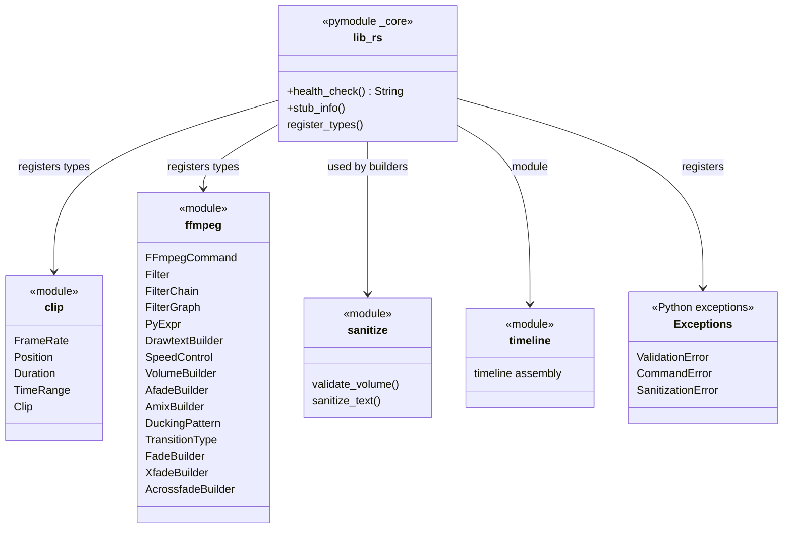

# C4 Code Level: Crate Root (lib.rs)

## Overview
- **Name**: stoat_ferret_core Crate Root
- **Description**: Crate entry point that defines the PyO3 Python module and registers all types and functions
- **Location**: `rust/stoat_ferret_core/src/`
- **Language**: Rust
- **Purpose**: Bootstraps the `_core` Python extension module, registers all PyO3 types/exceptions, and re-exports public API for the FFmpeg command builder library
- **Parent Component**: [Rust Core Engine](./c4-component-rust-core-engine.md)

## Code Elements

### Modules Declared

- `mod clip` -- Clip, FrameRate, Position, Duration, TimeRange types for video timeline manipulation
- `mod ffmpeg` -- FFmpeg command builder and filter graph construction (see `c4-code-rust-stoat-ferret-core-ffmpeg.md`)
- `mod sanitize` -- Input validation (volume ranges, string sanitization)
- `mod timeline` -- Timeline assembly operations

### Python Exceptions

- `ValidationError` -- raised on input validation failures (inherits `PyValueError`)
- `CommandError` -- raised on FFmpeg command construction errors (inherits `PyValueError`)
- `SanitizationError` -- raised on text sanitization failures (inherits `PyValueError`)

### Functions

#### `health_check() -> PyResult<String>`
- **Location**: `rust/stoat_ferret_core/src/lib.rs`
- **Description**: Returns `"ok"` as a simple Python-callable health check to verify the Rust extension is loaded
- **PyO3**: `#[pyfunction]`

#### `_core(m: &Bound<'_, PyModule>) -> PyResult<()>`
- **Location**: `rust/stoat_ferret_core/src/lib.rs`
- **Description**: PyO3 module initialization function. Registers all classes and functions in the `_core` Python module.
- **PyO3**: `#[pymodule]`

#### `stub_info() -> ...`
- **Location**: `rust/stoat_ferret_core/src/lib.rs`
- **Description**: Generates stub information for pyo3-stub-gen (`cargo run --bin stub_gen`)

### Registered Python Types

| Type | Module | Description |
|------|--------|-------------|
| `FrameRate` | clip | Frame rate representation (numerator/denominator) |
| `Position` | drawtext | Text position on video frame (enum with variants) |
| `Duration` | clip | Duration representation |
| `TimeRange` | clip | Time range with in/out points |
| `Clip` | clip | Video clip with timeline position |
| `ValidationError` | lib | Input validation exception |
| `FFmpegCommand` | command | Command builder for FFmpeg CLI arguments |
| `Filter` | filter | Single FFmpeg filter with name and parameters |
| `FilterChain` | filter | Chain of filters with input/output pad labels |
| `FilterGraph` | filter | Complete filter graph with multiple chains |
| `PyExpr` | expression | FFmpeg expression tree builder |
| `DrawtextBuilder` | drawtext | Text overlay filter builder |
| `SpeedControl` | speed | Speed adjustment filter builder |
| `VolumeBuilder` | audio | Audio volume filter builder |
| `AfadeBuilder` | audio | Audio fade filter builder |
| `AmixBuilder` | audio | Audio mix filter builder |
| `DuckingPattern` | audio | Speech ducking pattern builder |
| `TransitionType` | transitions | 59-variant xfade transition enum |
| `FadeBuilder` | transitions | Video fade filter builder |
| `XfadeBuilder` | transitions | Video crossfade filter builder |
| `AcrossfadeBuilder` | transitions | Audio crossfade filter builder |
| `health_check` | lib | Health check function |

## Dependencies

### Internal Dependencies
- `clip` module -- FrameRate, Position, Duration, TimeRange, Clip
- `ffmpeg` module -- all builder types and filter graph types
- `sanitize` module -- validation functions
- `timeline` module -- timeline assembly

### External Dependencies
- `pyo3` (pymodule, pyfunction, PyResult, Bound, PyModule)
- `pyo3_stub_gen` (stub generation for Python type hints)

## Relationships

