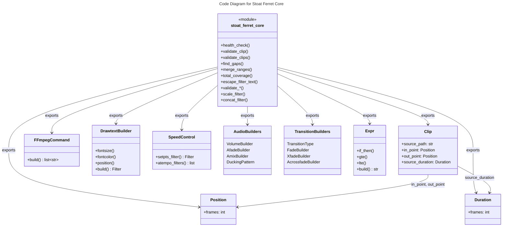

# C4 Code Level: Stoat Ferret Core (Python Bindings)

## Overview
- **Name**: Stoat Ferret Core Python Interface
- **Description**: Python package re-exporting Rust-powered video editing primitives via PyO3 bindings
- **Location**: `src/stoat_ferret_core/`
- **Language**: Python (wrapper for Rust via PyO3)
- **Purpose**: Provide Python-accessible types for clip validation, timeline math, FFmpeg command building, filter expression engine, audio/video effect builders, and input sanitization from the Rust core library
- **Parent Component**: [Python Bindings Layer](./c4-component-python-bindings.md)

## Code Elements

### Functions/Methods

#### __init__.py (re-exported from Rust `_core` module)

**Clip Operations:**
- `validate_clip(clip: Clip) -> list[ClipValidationError]` -- Validate a single clip
- `validate_clips(clips: list[Clip]) -> list[tuple[int, ClipValidationError]]` -- Validate multiple clips

**Timeline Operations:**
- `find_gaps(ranges: list[TimeRange]) -> list[TimeRange]` -- Find gaps between time ranges
- `merge_ranges(ranges: list[TimeRange]) -> list[TimeRange]` -- Merge overlapping/adjacent time ranges
- `total_coverage(ranges: list[TimeRange]) -> Duration` -- Calculate total duration covered

**Filter Helpers:**
- `scale_filter(width, height) -> Filter` -- Create a scale filter
- `concat_filter(n, v, a) -> Filter` -- Create a concat filter

**Sanitization Functions:**
- `escape_filter_text(text: str) -> str` -- Escape special characters in FFmpeg filter parameters
- `validate_path(path: str) -> None` -- Validate file paths are safe to use
- `validate_crf(value: int) -> int` -- Validate CRF quality values (0-51)
- `validate_speed(value: float) -> float` -- Validate speed multipliers (0.25-4.0)
- `validate_volume(value: float) -> float` -- Validate volume multipliers (0.0-10.0)
- `validate_video_codec(codec: str) -> str` -- Validate video codec names
- `validate_audio_codec(codec: str) -> str` -- Validate audio codec names
- `validate_preset(preset: str) -> str` -- Validate encoding preset names

**Utility:**
- `health_check() -> str` -- Verify the Rust extension is loaded and functional

### Classes/Modules (re-exported from Rust)

**Core Types:**
- `Clip` -- Video clip representing a segment of source media
- `ClipValidationError` -- Validation error with field, message, actual, expected
- `FrameRate` -- Frame rate representation with common presets
- `Position` -- Frame-accurate timeline position
- `Duration` -- Frame-accurate duration
- `TimeRange` -- Half-open interval [start, end) with set operations

**FFmpeg Command Building:**
- `FFmpegCommand` -- Type-safe builder for FFmpeg command arguments
- `Filter` -- Single FFmpeg filter with parameters
- `FilterChain` -- Sequence of filters connected with commas
- `FilterGraph` -- Multiple filter chains connected with semicolons

**Expression Engine:**
- `Expr` -- Type-safe FFmpeg filter expression builder

**Text/Speed Builders:**
- `DrawtextBuilder` -- Builder for FFmpeg drawtext filter with position, font, color
- `SpeedControl` -- Speed adjustment builder with setpts and atempo auto-chaining

**Audio Builders:**
- `VolumeBuilder` -- Volume adjustment filter (linear or dB)
- `AfadeBuilder` -- Audio fade in/out filter with curve types
- `AmixBuilder` -- Audio input mixing with duration modes and weights
- `DuckingPattern` -- Sidechain compression for speech-over-music ducking

**Transition Builders:**
- `TransitionType` -- Enum of 59 FFmpeg xfade transition types (fade, wipeleft, dissolve, etc.)
- `FadeBuilder` -- Video fade in/out with color and alpha support
- `XfadeBuilder` -- Video crossfade between two inputs
- `AcrossfadeBuilder` -- Audio crossfade between two inputs with curve types

### Exceptions (re-exported from Rust)

- `ValidationError` -- Raised when input validation fails
- `CommandError` -- Raised when FFmpeg command building fails
- `SanitizationError` -- Raised when input sanitization fails

### Fallback Behavior

When the Rust extension is not built, all exports are replaced with a `_not_built` stub that raises `RuntimeError` with a message to run `maturin develop`. Exceptions fall back to `RuntimeError`.

## Dependencies

### Internal Dependencies
- `stoat_ferret_core._core` -- Compiled Rust PyO3 extension module (the actual Rust library)

### External Dependencies
- None (pure re-export layer; all computation is in Rust)

## Relationships

