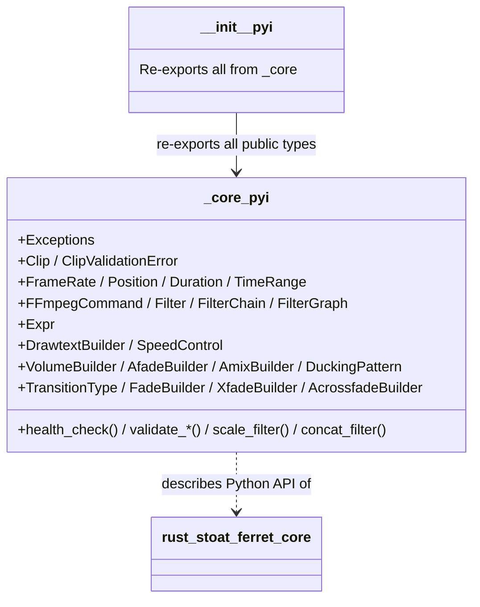

# C4 Code Level: Python Type Stubs

## Overview
- **Name**: Python Type Stubs for stoat_ferret_core
- **Description**: Manually maintained Python `.pyi` type stubs providing type annotations for the Rust PyO3 bindings
- **Location**: `stubs/stoat_ferret_core/`
- **Language**: Python (type stub files)
- **Purpose**: Provides complete Python type annotations for the `stoat_ferret_core` Rust extension module, enabling IDE autocompletion and mypy type checking
- **Parent Component**: [Python Bindings Layer](./c4-component-python-bindings.md)

## Code Elements

### Classes/Modules

#### `__init__.pyi` -- Package Re-exports

- Description: Re-exports all public types and functions from `_core` module with explicit `as` aliases for type checker visibility
- Exports (via `__all__`):
  - Utility: `health_check`
  - Clip types: `Clip`, `ClipValidationError`, `validate_clip`, `validate_clips`
  - Timeline types: `FrameRate`, `Position`, `Duration`, `TimeRange`
  - TimeRange operations: `find_gaps`, `merge_ranges`, `total_coverage`
  - Text/Speed: `DrawtextBuilder`, `SpeedControl`
  - Audio builders: `VolumeBuilder`, `AfadeBuilder`, `AmixBuilder`, `DuckingPattern`
  - Transition builders: `TransitionType`, `FadeBuilder`, `XfadeBuilder`, `AcrossfadeBuilder`
  - Expression engine: `Expr`
  - FFmpeg: `FFmpegCommand`, `Filter`, `FilterChain`, `FilterGraph`, `scale_filter`, `concat_filter`
  - Sanitization: `escape_filter_text`, `validate_path`, `validate_crf`, `validate_speed`, `validate_volume`, `validate_video_codec`, `validate_audio_codec`, `validate_preset`
  - Exceptions: `ValidationError`, `CommandError`, `SanitizationError`

#### `_core.pyi` -- Full Type Definitions

**Exceptions:**
- `ValidationError(Exception)` -- Custom exception for validation failures
- `CommandError(Exception)` -- Custom exception for FFmpeg command building failures
- `SanitizationError(Exception)` -- Custom exception for sanitization failures

**Core Data Types:**
- `Clip` -- Video clip with source_path, in_point, out_point, source_duration
- `ClipValidationError` -- Validation error data with field, message, actual, expected
- `FrameRate` -- Rational frame rate with static presets (fps_24, fps_25, fps_30, fps_60, ntsc_30, ntsc_60)
- `Position` -- Timeline position as frame count with from_frames, from_seconds, from_timecode
- `Duration` -- Timeline duration as frame count with from_frames, from_seconds, between
- `TimeRange` -- Half-open interval [start, end) with overlaps, adjacent, intersection, union, difference

**FFmpeg Command Building:**
- `FFmpegCommand` -- Builder with overwrite, loglevel, input, seek, duration, stream_loop, output, video_codec, audio_codec, preset, crf, format, filter_complex, map, build
- `Filter` -- Single filter with param(), and static methods: scale, scale_fit, concat, pad, format
- `FilterChain` -- Sequence of filters with input/output labels
- `FilterGraph` -- Multiple filter chains for -filter_complex

**Expression Engine:**
- `Expr` -- Type-safe expression builder for FFmpeg filter expressions

**Text/Speed Builders:**
- `DrawtextBuilder` -- Builder for drawtext filter (fontsize, fontcolor, position, font, build)
- `SpeedControl` -- Speed adjustment (setpts_filter, atempo_filters, drop_audio)

**Audio Builders:**
- `VolumeBuilder` -- Volume filter with from_db(), precision(), build()
- `AfadeBuilder` -- Audio fade with start_time(), curve(), build()
- `AmixBuilder` -- Audio mix with duration_mode(), weights(), normalize(), build()
- `DuckingPattern` -- Sidechain compression with threshold(), ratio(), attack(), release(), build()

**Transition Builders:**
- `TransitionType` -- Enum with 59 variants and from_str() class method
- `FadeBuilder` -- Video fade with start_time(), color(), alpha(), build()
- `XfadeBuilder` -- Video crossfade with transition type, duration, offset, build()
- `AcrossfadeBuilder` -- Audio crossfade with curve1(), curve2(), overlap(), build()

### Functions/Methods

- `health_check() -> str`
- `validate_clip(clip: Clip) -> list[ClipValidationError]`
- `validate_clips(clips: list[Clip]) -> list[tuple[int, ClipValidationError]]`
- `find_gaps(ranges: list[TimeRange]) -> list[TimeRange]`
- `merge_ranges(ranges: list[TimeRange]) -> list[TimeRange]`
- `total_coverage(ranges: list[TimeRange]) -> Duration`
- `scale_filter(width: int, height: int) -> Filter`
- `concat_filter(n: int, v: int, a: int) -> Filter`
- `escape_filter_text(input: str) -> str`
- `validate_path(path: str) -> None`
- `validate_crf(crf: int) -> int`
- `validate_speed(speed: float) -> float`
- `validate_volume(volume: float) -> float`
- `validate_video_codec(codec: str) -> str`
- `validate_audio_codec(codec: str) -> str`
- `validate_preset(preset: str) -> str`

## Dependencies

### Internal Dependencies
- `stoat_ferret_core._core` -- The actual Rust PyO3 compiled module that these stubs describe

### External Dependencies
- None (pure type stubs, no runtime dependencies)

## Relationships

