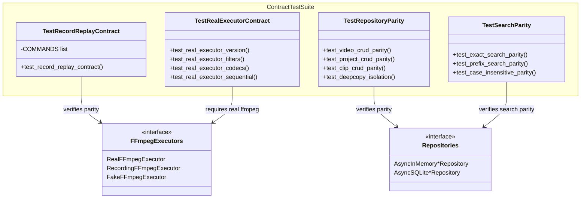

# C4 Code Level: Contract Tests

## Overview

- **Name**: Contract Tests
- **Description**: Parity tests ensuring InMemory and SQLite repository implementations behave identically, plus FFmpeg executor contract tests
- **Location**: `tests/test_contract/`
- **Language**: Python (pytest, async)
- **Purpose**: Guarantees that test doubles (InMemory repos) faithfully match production implementations (SQLite), and that FFmpeg executor variants (Real, Recording, Fake) produce consistent results
- **Parent Component**: [Test Infrastructure](./c4-component-test-infrastructure.md)

## Code Elements

### Test Inventory (37 tests across 3 test files)

| File | Tests | Coverage |
|------|-------|----------|
| test_ffmpeg_contract.py | 22 | Real/Recording/Fake FFmpeg executor parity |
| test_repository_parity.py | 8 | InMemory vs SQLite for Video/Project/Clip CRUD |
| test_search_parity.py | 7 | InMemory vs SQLite FTS5 search behavior |

### test_ffmpeg_contract.py (~22 tests)

#### Helper Functions

- `_make_recording(args, returncode, stdout, stderr, duration) -> dict` (line 27) -- Builds single recording dict matching RecordingFFmpegExecutor format
- `_save_recordings(path, recordings) -> None` (line 48) -- Persists recordings to JSON file for replay

#### Fixtures

- `recording_path(tmp_path) -> Path` (line 59) -- Temporary path for recording files

#### Test Classes (marked with @pytest.mark.contract)

- `TestRecordReplayContract` (line 70) -- Recording executor output replays identically through Fake executor
  - Parametrized over 5 FFmpeg commands
  - Verifies recorded output replays with identical behavior

- `TestRealExecutorContract` -- Real FFmpeg executor behavior contracts (requires @requires_ffmpeg)
  - Tests: version, filters, codecs, invalid input, hide_banner, sequential execution

- `TestStrictModeContract` -- Strict mode matching and error conditions
  - Tests: strict matching, mismatch error, load from file

- `TestErrorConsistency` -- Error handling parity across executors
  - Tests: exhaustion error, error delegation

### test_repository_parity.py (~8 tests)

InMemory vs SQLite parity for core CRUD operations:
- Video CRUD: add, get, update, delete with identical results
- Project CRUD: add, get, update, delete with identical results
- Clip CRUD: add, list_by_project ordering with identical results
- Deepcopy isolation: verifies InMemory repos return copies, not references
- Seed behavior: verifies seed populates repos correctly

### test_search_parity.py (~7 tests)

InMemory vs SQLite FTS5 search behavior:
- Exact match search: both implementations return same results
- Prefix search: token prefix matching parity
- Case-insensitive search: case handling consistency
- Multi-word search: compound query behavior
- Empty results: no-match query handling
- Multiple videos: ranking and order consistency

## Dependencies

### Internal Dependencies

- `stoat_ferret.ffmpeg.executor` (RealFFmpegExecutor, RecordingFFmpegExecutor, FakeFFmpegExecutor, ExecutionResult)
- `stoat_ferret.db.async_repository` (AsyncInMemoryVideoRepository, AsyncSQLiteVideoRepository)
- `stoat_ferret.db.clip_repository` (AsyncInMemoryClipRepository, AsyncSQLiteClipRepository)
- `stoat_ferret.db.project_repository` (AsyncInMemoryProjectRepository, AsyncSQLiteProjectRepository)
- `stoat_ferret.db.models` (Clip, Project, Video)
- `stoat_ferret.db.schema` (table DDL, FTS triggers, indexes)
- `tests.conftest` (requires_ffmpeg decorator)

### External Dependencies

- `pytest`, `aiosqlite`, `json`, `pathlib`, `dataclasses` (replace)

## Relationships

## Notes

- Marked with `pytest.mark.contract` for selective execution
- Real executor tests require FFmpeg installed and are marked with `@requires_ffmpeg`
- Recording/replay pattern enables deterministic testing without FFmpeg dependency
- Repository parity tests verify deepcopy isolation and seed behavior
- Search parity tests verify FTS5 indexing consistency between implementations
