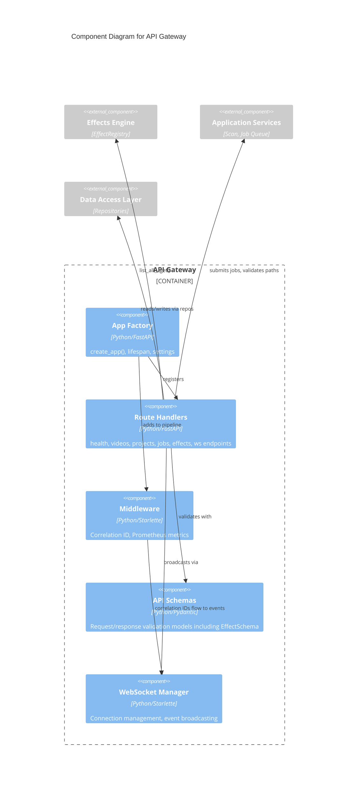

# C4 Component Level: API Gateway

## Overview
- **Name**: API Gateway
- **Description**: FastAPI application providing REST endpoints, WebSocket connectivity, middleware, request/response schemas, and configuration for the video editor backend
- **Type**: Application
- **Technology**: Python, FastAPI, Starlette, Pydantic, Prometheus, WebSocket

## Purpose

The API Gateway is the HTTP/WebSocket entry point for all client interactions with stoat-and-ferret. It provides a RESTful API for managing videos, projects, clips, jobs, and effects, plus a WebSocket endpoint for real-time event broadcasting. The gateway handles request routing, input validation via Pydantic schemas, cross-cutting concerns (correlation IDs, Prometheus metrics), and application lifecycle management.

The gateway uses FastAPI's dependency injection system for testability — repositories, job queues, and services are injected via `create_app()` kwargs, allowing tests to substitute in-memory doubles without monkey-patching. The application factory pattern (`create_app()`) configures all routers, middleware, metrics, and static file serving.

The v006 update adds an effects router that exposes the Effects Engine registry over HTTP, enabling clients to discover available effects with their parameter schemas and AI hints.

## Software Features
- **REST API**: CRUD endpoints for videos, projects, clips, and jobs under `/api/v1/`
- **Effects Discovery**: Endpoints for listing and retrieving available effects with parameter schemas and AI hints
- **Effect Application**: Endpoint for applying an effect to a clip via job submission
- **WebSocket**: Real-time event broadcasting at `/ws` with heartbeat and connection management
- **Health Checks**: Liveness (`/health/live`) and readiness (`/health/ready`) probes
- **Request Tracing**: Correlation ID middleware for distributed tracing
- **Metrics**: Prometheus HTTP request metrics and `/metrics` endpoint
- **Schema Validation**: Pydantic models for all request/response payloads
- **Static File Serving**: GUI static files mounted at `/gui`
- **Configuration**: Environment-based settings with `STOAT_` prefix

## Code Elements

This component contains:
- [c4-code-stoat-ferret-api.md](./c4-code-stoat-ferret-api.md) — Application factory, settings, lifespan management, entry point
- [c4-code-python-api.md](./c4-code-python-api.md) — Higher-level API layer overview with routers, schemas, services, and WebSocket
- [c4-code-stoat-ferret-api-routers.md](./c4-code-stoat-ferret-api-routers.md) — REST/WebSocket route handlers (health, videos, projects, jobs, effects, ws)
- [c4-code-stoat-ferret-api-middleware.md](./c4-code-stoat-ferret-api-middleware.md) — CorrelationIdMiddleware, MetricsMiddleware
- [c4-code-stoat-ferret-api-schemas.md](./c4-code-stoat-ferret-api-schemas.md) — Pydantic request/response models
- [c4-code-python-schemas.md](./c4-code-python-schemas.md) — Schema definitions overview with effect and job schemas
- [c4-code-stoat-ferret-api-websocket.md](./c4-code-stoat-ferret-api-websocket.md) — ConnectionManager, EventType, event builder

## Interfaces

### REST API
- **Protocol**: HTTP/REST (JSON)
- **Description**: CRUD operations for all domain entities plus effect discovery
- **Operations**:
  - `GET /health/live` — Liveness probe
  - `GET /health/ready` — Readiness probe (DB + FFmpeg checks)
  - `GET /api/v1/videos?limit&offset` — List videos with pagination
  - `GET /api/v1/videos/search?q&limit` — Search videos by filename/path
  - `GET /api/v1/videos/{id}` — Get video by ID
  - `GET /api/v1/videos/{id}/thumbnail` — Get video thumbnail image
  - `POST /api/v1/videos/scan` — Submit directory scan job
  - `DELETE /api/v1/videos/{id}` — Delete video
  - `GET /api/v1/projects?limit&offset` — List projects
  - `POST /api/v1/projects` — Create project
  - `GET /api/v1/projects/{id}` — Get project
  - `DELETE /api/v1/projects/{id}` — Delete project
  - `GET /api/v1/projects/{id}/clips` — List clips in project
  - `POST /api/v1/projects/{id}/clips` — Add clip to project (with Rust validation)
  - `PATCH /api/v1/projects/{id}/clips/{clip_id}` — Update clip
  - `DELETE /api/v1/projects/{id}/clips/{clip_id}` — Delete clip
  - `GET /api/v1/jobs/{id}` — Get job status
  - `GET /api/v1/effects` — List all available effects with schemas and AI hints
  - `GET /api/v1/effects/{effect_type}` — Get single effect definition
  - `POST /api/v1/effects/{effect_type}/apply` — Apply effect to clip (enqueues job)

### WebSocket API
- **Protocol**: WebSocket (JSON messages)
- **Description**: Real-time event broadcasting to connected clients
- **Operations**:
  - `WS /ws` — Connect for real-time events (HEALTH_STATUS, SCAN_STARTED, SCAN_COMPLETED, PROJECT_CREATED, HEARTBEAT)

### Prometheus Metrics
- **Protocol**: HTTP (Prometheus text format)
- **Description**: Application metrics endpoint
- **Operations**:
  - `GET /metrics` — Prometheus metrics (request count, duration histograms)

## Dependencies

### Components Used
- **Application Services**: Scan service, thumbnail service for business logic
- **Data Access Layer**: Repository protocols for video, project, clip persistence
- **Effects Engine**: EffectRegistry for effect discovery and parameter schemas
- **Python Bindings Layer**: Clip validation via `stoat_ferret_core`

### External Systems
- **uvicorn**: ASGI server for running the application
- **Prometheus**: Metrics collection and monitoring
- **Starlette**: WebSocket support and middleware infrastructure

## Component Diagram

