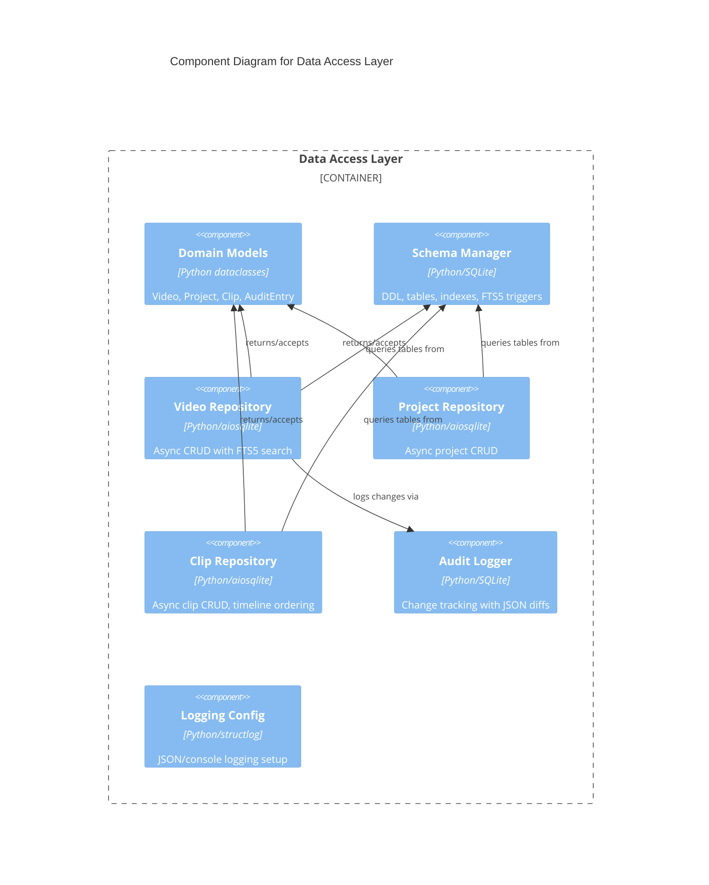

# C4 Component Level: Data Access Layer

## Overview
- **Name**: Data Access Layer
- **Description**: SQLite-based persistence layer with repository pattern for videos, projects, clips, and audit logging, plus application-wide infrastructure
- **Type**: Data Access
- **Technology**: Python, SQLite, aiosqlite, structlog

## Purpose

The Data Access Layer provides all data persistence and retrieval for stoat-and-ferret using the repository pattern. It defines protocol interfaces for video, project, and clip repositories, with both synchronous (SQLite) and asynchronous (aiosqlite) implementations, plus in-memory implementations for testing. The layer also includes domain model definitions (with effects and transitions stored as JSON), database schema management, FTS5 full-text search, and audit logging.

The package root (`stoat_ferret`) providing version metadata and structured logging configuration is included here as foundational infrastructure that the entire application depends on.

## Software Features
- **Repository Pattern**: Protocol-based abstractions with SQLite and in-memory implementations
- **Async Support**: Full async/await repository implementations via aiosqlite for FastAPI integration
- **Domain Models**: Dataclass definitions for Video, Project (with transitions), Clip (with effects), and AuditEntry with Rust validation bridge
- **Full-Text Search**: FTS5 index on video filename/path for fast search
- **Audit Logging**: Change tracking with operation, entity type, entity ID, and JSON diff
- **Schema Management**: DDL for all tables, indexes, and FTS triggers
- **Structured Logging**: Application-wide structlog configuration with JSON/console output
- **Test Doubles**: In-memory repositories with deepcopy isolation and seed helpers

## Code Elements

This component contains:
- [c4-code-stoat-ferret-db.md](./c4-code-stoat-ferret-db.md) -- Repository protocols/impls, domain models, schema, audit logger
- [c4-code-python-db.md](./c4-code-python-db.md) -- Database layer overview with models and repository pattern
- [c4-code-stoat-ferret.md](./c4-code-stoat-ferret.md) -- Package root with version metadata and logging configuration

## Interfaces

### Video Repository (Async)
- **Protocol**: Python protocol (async)
- **Operations**: add, get, get_by_path, list_videos, search, count, update, delete

### Project Repository (Async)
- **Protocol**: Python protocol (async)
- **Operations**: add, get, list_projects, update, delete

### Clip Repository (Async)
- **Protocol**: Python protocol (async)
- **Operations**: add, get, list_by_project, update, delete

### Logging Configuration
- **Operations**: `configure_logging(json_format: bool, level: int) -> None`

## Dependencies

### Components Used
- **Python Bindings Layer**: Clip model uses `stoat_ferret_core` for Rust-side clip validation

### External Systems
- **SQLite**: Persistent storage via sqlite3 (sync) and aiosqlite (async)
- **structlog**: Structured logging framework

## Component Diagram

