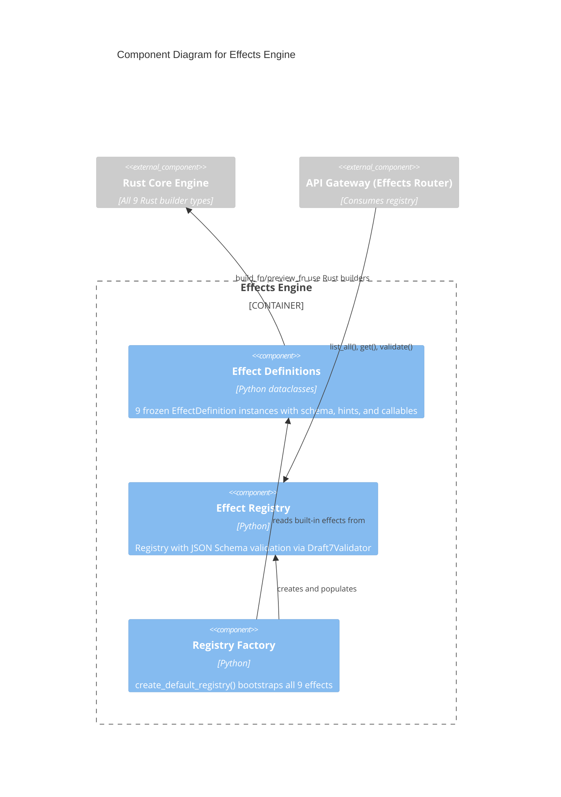

# C4 Component Level: Effects Engine

## Overview
- **Name**: Effects Engine
- **Description**: Effect definition registry providing 9 discoverable, schema-driven video/audio effect definitions with JSON Schema parameters, AI hints, and filter preview generation
- **Type**: Service
- **Technology**: Python, dataclasses, jsonschema, structlog

## Purpose

The Effects Engine provides the domain model for video and audio effects discovery, validation, and parameter description. It defines what effects are available (text overlay, speed control, volume, audio fade, audio mix, audio ducking, video fade, crossfade, audio crossfade), describes their parameters using JSON Schema, provides AI guidance strings for each parameter, and validates user-supplied parameters against those schemas.

The component follows a Registry pattern: effects are defined as immutable dataclass instances with embedded parameter schemas and callable build/preview functions, then registered into a mutable EffectRegistry. A factory function creates a fully populated default registry with all 9 built-in effects. Build functions generate real FFmpeg filter strings by delegating to the Rust Core Engine builders, ensuring outputs remain accurate as filter implementations evolve.

This domain is kept separate from the API Gateway (which handles HTTP concerns) and Application Services (which handle execution concerns). The Effects Engine solely defines the effect catalogue -- what effects exist, how they are described, and how they produce filter strings.

## Software Features
- **Effect Registry**: Mutable registry mapping effect type strings to EffectDefinition instances with JSON Schema validation
- **Immutable Definitions**: Frozen dataclass EffectDefinition with name, description, parameter schema, AI hints, preview and build callables
- **JSON Schema Parameters**: Structured parameter schemas enabling API validation and dynamic UI generation
- **AI Hints**: Per-parameter natural language guidance strings for AI-driven parameter generation
- **Preview Generation**: Callable preview functions producing real FFmpeg filter strings via Rust builders
- **9 Built-in Effects**: TEXT_OVERLAY, SPEED_CONTROL, VOLUME, AUDIO_FADE, AUDIO_MIX, AUDIO_DUCKING, VIDEO_FADE, XFADE, ACROSSFADE
- **Factory Function**: create_default_registry() bootstraps production-ready registry with all built-in effects

## Code Elements

This component contains:
- [c4-code-python-effects.md](./c4-code-python-effects.md) -- EffectDefinition dataclass, EffectRegistry with jsonschema validation, EffectValidationError, 9 built-in effects, create_default_registry()

## Interfaces

### Effect Registry API
- **Protocol**: Python module import (internal)
- **Description**: Discovery, retrieval, and validation of available video/audio effects
- **Operations**:
  - `create_default_registry() -> EffectRegistry` -- Create registry with all 9 built-in effects
  - `EffectRegistry.register(effect_type: str, definition: EffectDefinition) -> None` -- Register effect
  - `EffectRegistry.get(effect_type: str) -> EffectDefinition | None` -- Retrieve definition
  - `EffectRegistry.list_all() -> list[tuple[str, EffectDefinition]]` -- List all effects
  - `EffectRegistry.validate(effect_type: str, parameters: dict) -> list[EffectValidationError]` -- Validate params via JSON Schema

### EffectDefinition Fields
- **Protocol**: Python dataclass attributes (read-only)
- **Description**: Structured effect metadata for API response serialization
- **Attributes**:
  - `name: str` -- Human-readable effect name
  - `description: str` -- Effect purpose description
  - `parameter_schema: dict[str, object]` -- JSON Schema describing parameters
  - `ai_hints: dict[str, str]` -- Per-parameter AI guidance strings
  - `preview_fn: Callable[[], str]` -- Returns example FFmpeg filter string
  - `build_fn: Callable[[dict[str, Any]], str]` -- Receives parameters, returns FFmpeg filter string

## Dependencies

### Components Used
- **Rust Core Engine** (via Python Bindings): DrawtextBuilder, SpeedControl, VolumeBuilder, AfadeBuilder, AmixBuilder, DuckingPattern, FadeBuilder, XfadeBuilder, AcrossfadeBuilder, TransitionType

### External Systems
- **jsonschema**: Draft7Validator for parameter validation

## Component Diagram

