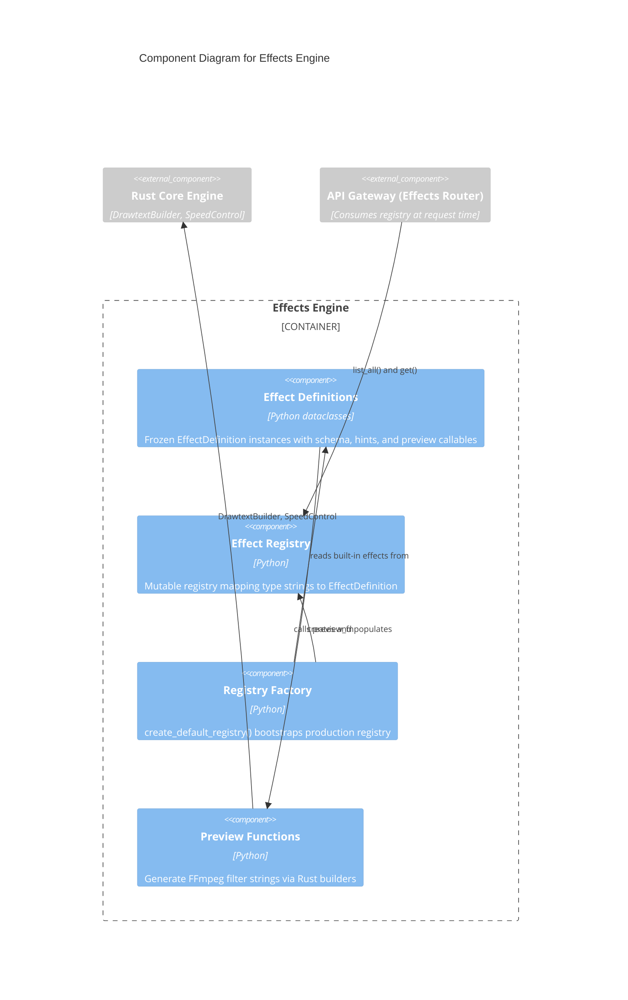

# C4 Component Level: Effects Engine

## Overview
- **Name**: Effects Engine
- **Description**: Effect definition registry providing discoverable, schema-driven video effect definitions with AI parameter hints for the effects API
- **Type**: Service
- **Technology**: Python, dataclasses, structlog

## Purpose

The Effects Engine provides the domain model for video effects discovery and parameter description. It defines what effects are available (text overlay, speed control), describes their parameters using JSON Schema, and provides AI guidance strings for each parameter. This enables both human users and AI-driven clients to understand how to parameterize effects without prior knowledge.

The component follows a Registry pattern: effects are defined as immutable dataclass instances with embedded parameter schemas and callable preview functions, then registered into a mutable EffectRegistry. A factory function creates a fully populated default registry. Preview functions generate real FFmpeg filter strings by delegating to the Rust Core Engine, ensuring examples remain accurate as filter implementations evolve.

This domain is kept separate from the API Gateway (which handles HTTP concerns) and Application Services (which handle execution concerns). The Effects Engine solely defines the effect catalogue — what effects exist and how they are described.

## Software Features
- **Effect Registry**: Mutable registry mapping effect type strings to EffectDefinition instances
- **Immutable Definitions**: Frozen dataclass EffectDefinition with name, description, parameter schema, AI hints, and preview callable
- **JSON Schema Parameters**: Structured parameter schemas enabling validation and UI generation
- **AI Hints**: Per-parameter natural language guidance strings for AI-driven parameter generation
- **Preview Generation**: Callable preview functions producing real FFmpeg filter strings via Rust Core Engine
- **Built-in Effects**: TEXT_OVERLAY (drawtext with positioning, styling) and SPEED_CONTROL (setpts + atempo with chaining)
- **Factory Function**: create_default_registry() bootstraps production-ready registry with all built-in effects

## Code Elements

This component contains:
- [c4-code-python-effects.md](./c4-code-python-effects.md) — EffectDefinition dataclass, EffectRegistry, built-in effects (TEXT_OVERLAY, SPEED_CONTROL), create_default_registry()

## Interfaces

### Effect Registry API
- **Protocol**: Python module import (internal)
- **Description**: Discovery and retrieval of available video effects
- **Operations**:
  - `create_default_registry() -> EffectRegistry` — Create registry with all built-in effects registered
  - `EffectRegistry.register(effect_type: str, definition: EffectDefinition) -> None` — Register effect by type key
  - `EffectRegistry.get(effect_type: str) -> EffectDefinition | None` — Retrieve effect definition by type
  - `EffectRegistry.list_all() -> list[tuple[str, EffectDefinition]]` — List all registered effects

### EffectDefinition Fields
- **Protocol**: Python dataclass attributes (read-only)
- **Description**: Structured effect metadata for API response serialization
- **Attributes**:
  - `name: str` — Human-readable effect name
  - `description: str` — Effect purpose description
  - `parameter_schema: dict[str, object]` — JSON Schema describing parameters
  - `ai_hints: dict[str, str]` — Per-parameter AI guidance strings
  - `preview_fn: Callable[[], str]` — Returns example FFmpeg filter string

## Dependencies

### Components Used
- **Rust Core Engine**: DrawtextBuilder and SpeedControl used in preview functions to generate real FFmpeg filter strings

### External Systems
- None (pure Python computation)

## Component Diagram

