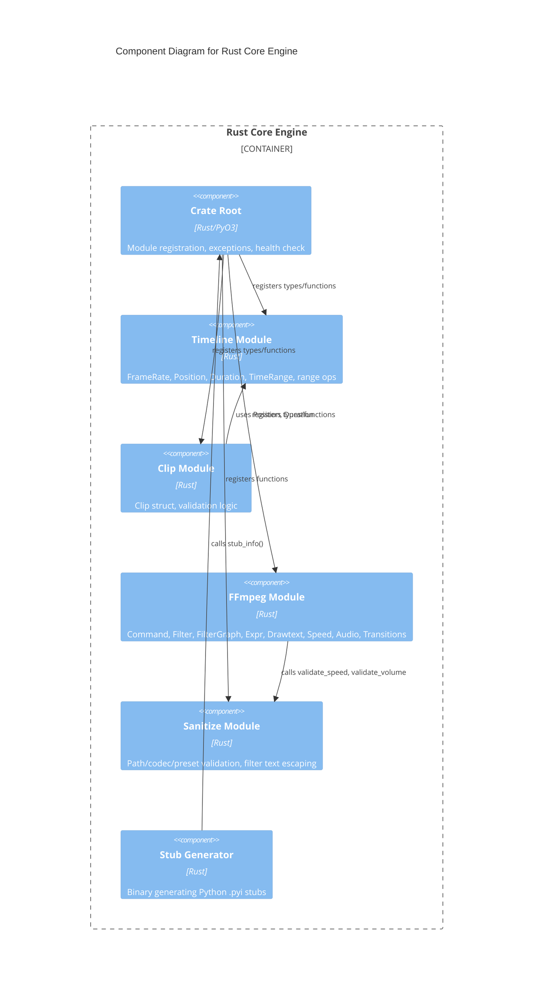

# C4 Component Level: Rust Core Engine

## Overview
- **Name**: Rust Core Engine
- **Description**: High-performance Rust library providing frame-accurate timeline math, clip validation, FFmpeg command building, filter graph construction, expression trees, audio effect builders, video/audio transition builders, and input sanitization with PyO3 bindings
- **Type**: Library
- **Technology**: Rust, PyO3, pyo3-stub-gen

## Purpose

The Rust Core Engine is the computational heart of stoat-and-ferret. It implements all performance-critical and safety-critical operations in Rust, exposing them to Python through PyO3 bindings. This includes frame-accurate timeline mathematics using integer frame counts (avoiding floating-point precision issues), video clip representation and validation, type-safe FFmpeg command construction with full filter graph support, a typed expression tree for FFmpeg filter expressions, specialized builders for drawtext, speed control, audio effects (volume, fade, mix, ducking), video/audio transitions (fade, crossfade, 59 xfade types), and input sanitization to prevent command injection.

By implementing these operations in Rust, the system achieves both correctness (Rust's type system prevents many classes of bugs) and performance (native-speed computation for timeline math and filter graph assembly). The PyO3 bindings provide a clean Python API, making the Rust library transparent to Python consumers.

## Software Features
- **Timeline Mathematics**: Frame-accurate position, duration, and time range types with set operations (overlap, gap, merge, intersection, union, difference)
- **Clip Validation**: Comprehensive validation of video clips against source constraints with detailed error reporting
- **FFmpeg Command Building**: Type-safe builder pattern for FFmpeg argument construction with filter graph support
- **Filter Graph Construction**: Filter, FilterChain, and FilterGraph types with cycle detection and label validation
- **Expression Trees**: Typed expression tree (Expr/PyExpr) for time-based and conditional FFmpeg filter expressions
- **Drawtext Builder**: Type-safe builder for FFmpeg drawtext filters with positioning, alpha fade, and shadow support
- **Speed Control**: Video and audio speed adjustment builder with automatic atempo chaining for extreme speeds
- **Audio Builders**: VolumeBuilder, AfadeBuilder, AmixBuilder, and DuckingPattern for audio processing filter generation
- **Transition Builders**: FadeBuilder, XfadeBuilder, AcrossfadeBuilder with 59 TransitionType variants for video/audio transitions
- **Input Sanitization**: Security-focused validation of paths, codecs, presets, and FFmpeg filter text escaping
- **Stub Generation**: Binary for generating Python type stubs from PyO3 annotations

## Code Elements

This component contains:
- [c4-code-rust-core.md](./c4-code-rust-core.md) -- Crate root (lib.rs), PyO3 module registration, custom exceptions, health check
- [c4-code-rust-ffmpeg.md](./c4-code-rust-ffmpeg.md) -- FFmpegCommand builder, Filter, FilterChain, FilterGraph, Expr/PyExpr, DrawtextBuilder, SpeedControl
- [c4-code-rust-stoat-ferret-core-src.md](./c4-code-rust-stoat-ferret-core-src.md) -- Crate root with module declarations and type registration
- [c4-code-rust-stoat-ferret-core-timeline.md](./c4-code-rust-stoat-ferret-core-timeline.md) -- FrameRate, Position, Duration, TimeRange types with range operations
- [c4-code-rust-stoat-ferret-core-clip.md](./c4-code-rust-stoat-ferret-core-clip.md) -- Clip struct, ValidationError, validate_clip/validate_clips functions
- [c4-code-rust-stoat-ferret-core-ffmpeg.md](./c4-code-rust-stoat-ferret-core-ffmpeg.md) -- FFmpeg module with audio builders, transition builders, and all submodules
- [c4-code-rust-stoat-ferret-core-sanitize.md](./c4-code-rust-stoat-ferret-core-sanitize.md) -- escape_filter_text, validate_path, validate_crf/speed/volume/codec/preset
- [c4-code-rust-stoat-ferret-core-bin.md](./c4-code-rust-stoat-ferret-core-bin.md) -- stub_gen binary for Python type stub generation

## Interfaces

### PyO3 Module API (`_core`)
- **Protocol**: Python C extension (PyO3)
- **Description**: Exposes all Rust types and functions as a Python module
- **Key Operations**:
  - `health_check() -> str` -- Verify extension is loaded
  - `validate_clip(clip: Clip) -> list[ClipValidationError]` -- Validate single clip
  - `FFmpegCommand()` -- Type-safe FFmpeg argument builder
  - `FilterGraph.new() -> FilterGraph` -- Create filter graph with validation
  - `DrawtextBuilder(text: str)` -- Create drawtext filter builder
  - `SpeedControl(factor: float)` -- Create speed adjustment builder
  - `VolumeBuilder(volume: float)` -- Create volume filter builder
  - `AfadeBuilder(fade_type: str, duration: float)` -- Create audio fade builder
  - `AmixBuilder(inputs: int)` -- Create audio mix builder
  - `DuckingPattern()` -- Create sidechain compression builder
  - `FadeBuilder(fade_type: str, duration: float)` -- Create video fade builder
  - `XfadeBuilder(transition: TransitionType, duration: float, offset: float)` -- Create video crossfade builder
  - `AcrossfadeBuilder(duration: float)` -- Create audio crossfade builder
  - `escape_filter_text(text: str) -> str` -- Escape FFmpeg filter special chars
  - `validate_path(path: str) -> None` -- Validate file path safety

## Dependencies

### Components Used
- None (leaf component -- no dependencies on other application components)

### External Systems
- **PyO3**: Rust-Python bridge for module definition and type marshaling
- **pyo3-stub-gen**: Automatic stub generation from PyO3 annotations
- **proptest** (test-only): Property-based testing for timeline invariants and filter graph properties

## Component Diagram

