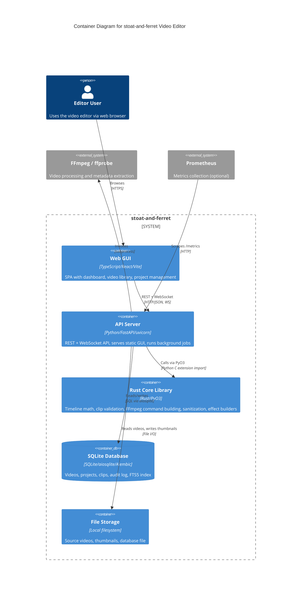

# C4 Container Level: System Deployment

## Container Diagram

## Containers

### API Server

- **Name**: API Server
- **Description**: The FastAPI backend that hosts the REST API, WebSocket endpoint, background job worker, effects registry, and serves the built GUI as static files. This is the single running process for the application.
- **Type**: API / Web Application
- **Technology**: Python 3.10+, FastAPI, uvicorn, Starlette, Pydantic, asyncio, structlog, prometheus-client
- **Deployment**: `python -m stoat_ferret.api` (uvicorn on port 8000). Dockerfile available for containerized testing.

#### Purpose

The API Server is the sole runtime process for stoat-and-ferret. It provides a RESTful API under `/api/v1/` for managing videos, projects, clips, jobs, and effects; a WebSocket endpoint at `/ws` for real-time event broadcasting; health probes at `/health/live` and `/health/ready`; Prometheus metrics at `/metrics`; and serves the pre-built React SPA at `/gui`. It runs an in-process async job queue for long-running operations like directory scanning. The v006 update adds an effects discovery and application API backed by the Effects Engine registry.

#### Components Deployed

- [API Gateway](./c4-component-api-gateway.md) -- REST/WebSocket endpoints, middleware, schemas, settings, effects router
- [Effects Engine](./c4-component-effects-engine.md) -- EffectRegistry, EffectDefinition, built-in TEXT_OVERLAY and SPEED_CONTROL effects
- [Application Services](./c4-component-application-services.md) -- Scan service, thumbnail generation, FFmpeg execution, job queue
- [Data Access Layer](./c4-component-data-access.md) -- Repository pattern, domain models, schema, audit logging
- [Python Bindings Layer](./c4-component-python-bindings.md) -- Re-exports from Rust core, type stubs

#### Interfaces

- **REST API**: HTTP/JSON -- [OpenAPI spec](./apis/api-server-api.yaml)
  - `GET /health/live` -- Liveness probe
  - `GET /health/ready` -- Readiness probe (DB + FFmpeg checks)
  - `GET /api/v1/videos` -- List videos with pagination
  - `GET /api/v1/videos/search` -- Search videos by filename/path
  - `GET /api/v1/videos/{video_id}` -- Get video by ID
  - `GET /api/v1/videos/{video_id}/thumbnail` -- Get thumbnail image
  - `POST /api/v1/videos/scan` -- Submit directory scan job
  - `DELETE /api/v1/videos/{video_id}` -- Delete video
  - `GET /api/v1/projects` -- List projects
  - `POST /api/v1/projects` -- Create project
  - `GET /api/v1/projects/{project_id}` -- Get project
  - `DELETE /api/v1/projects/{project_id}` -- Delete project
  - `GET /api/v1/projects/{project_id}/clips` -- List clips in project
  - `POST /api/v1/projects/{project_id}/clips` -- Add clip to project
  - `PATCH /api/v1/projects/{project_id}/clips/{clip_id}` -- Update clip
  - `DELETE /api/v1/projects/{project_id}/clips/{clip_id}` -- Delete clip
  - `GET /api/v1/jobs/{job_id}` -- Get job status
  - `GET /api/v1/effects` -- List all available effects with parameter schemas and AI hints
  - `GET /api/v1/effects/{effect_type}` -- Get single effect definition
  - `POST /api/v1/effects/{effect_type}/apply` -- Apply effect to clip (enqueues job)
- **WebSocket**: WS/JSON at `/ws` -- Real-time events (HEALTH_STATUS, SCAN_STARTED, SCAN_COMPLETED, PROJECT_CREATED, HEARTBEAT)
- **Prometheus Metrics**: HTTP at `/metrics` -- Request count, duration histograms
- **Static GUI**: HTTP at `/gui` -- Serves built React SPA assets

#### Dependencies

- **SQLite Database**: SQL via aiosqlite (in-process connection)
- **File Storage**: Reads source video files, writes thumbnails to `data/thumbnails/`
- **Rust Core Library**: PyO3 import for clip validation, FFmpeg command building, DrawtextBuilder, SpeedControl
- **FFmpeg / ffprobe**: Subprocess invocation for video processing and metadata extraction
- **Prometheus** (optional): Scrapes `/metrics` endpoint

#### Infrastructure

- **Config**: [Dockerfile](../../Dockerfile) (multi-stage build for testing), [docker-compose.yml](../../docker-compose.yml)
- **Entry point**: `python -m stoat_ferret.api` or `uvicorn stoat_ferret.api.app:create_app`
- **Settings**: Environment variables with `STOAT_` prefix (host, port, database path, scan roots, GUI static path)
- **Scaling**: Single-process; horizontal scaling not supported (SQLite file-based, in-process job queue)
- **CI**: [.github/workflows/ci.yml](../../.github/workflows/ci.yml) -- 9-matrix test across 3 OS x 3 Python versions

---

### Web GUI

- **Name**: Web GUI
- **Description**: React single-page application built with Vite, served as static files by the API Server. In development, runs as a separate Vite dev server with API proxy.
- **Type**: Web Application (SPA)
- **Technology**: TypeScript, React 19, Vite 7, Tailwind CSS 4, Zustand 5, React Router 7
- **Deployment**: Pre-built to `gui/dist/` and served by API Server at `/gui`. Dev mode: `npm run dev` (Vite dev server on port 5173 with proxy to API on port 8000).

#### Purpose

The Web GUI provides the browser-based interface for stoat-and-ferret. It renders three views: a real-time dashboard with health monitoring, Prometheus metrics, and WebSocket activity log; a video library browser with search, sort, pagination, and directory scan trigger; and a project management view for creating projects and managing clips on a timeline.

#### Components Deployed

- [Web GUI](./c4-component-web-gui.md) -- All React components, hooks, stores, pages

#### Interfaces

- **User Interface**: Web browser (HTML/CSS/JS)
  - `/` -- Dashboard (health cards, metrics, activity log)
  - `/library` -- Video library (search, sort, pagination, scan)
  - `/projects` -- Project management (CRUD, clip timeline)

#### Dependencies

- **API Server**: All data via REST (`/api/v1/*`) + WebSocket (`/ws`) + health (`/health/ready`) + metrics (`/metrics`)

#### Infrastructure

- **Config**: [gui/package.json](../../gui/package.json)
- **Build**: `npm run build` produces static assets in `gui/dist/`
- **Dev proxy**: Vite proxies `/api`, `/health`, `/metrics`, `/ws` to `http://localhost:8000`
- **CI**: Frontend CI job runs `npm ci && npm run build && npx vitest run`

---

### Rust Core Library

- **Name**: Rust Core Library
- **Description**: Compiled native extension loaded by the API Server process at import time. Not a separate running container -- it is an in-process shared library (.so/.dll/.dylib).
- **Type**: Library (in-process, not a standalone container)
- **Technology**: Rust, PyO3, maturin
- **Deployment**: Built with `maturin develop` (dev) or `maturin build --release` (Docker). Loaded as Python C extension `stoat_ferret_core._core`.

#### Purpose

The Rust Core Library implements all performance-critical and safety-critical operations: frame-accurate timeline mathematics, clip validation against source constraints, type-safe FFmpeg command construction, filter graph assembly, DrawtextBuilder and SpeedControl effect builders (used by the Effects Engine), and input sanitization to prevent command injection. It is compiled to a native Python extension and imported in-process by the API Server.

#### Components Deployed

- [Rust Core Engine](./c4-component-rust-core-engine.md) -- Timeline math, clip validation, FFmpeg commands, filter graph, DrawtextBuilder, SpeedControl, sanitization
- [Python Bindings Layer](./c4-component-python-bindings.md) -- Re-exports, type stubs (wraps the compiled extension)

#### Interfaces

- **PyO3 Module API**: Python C extension import (`from stoat_ferret_core import ...`)
  - Timeline types: FrameRate, Position, Duration, TimeRange
  - Range operations: find_gaps, merge_ranges, total_coverage
  - Clip validation: validate_clip, validate_clips
  - FFmpeg: FFmpegCommand builder, Filter, FilterChain, FilterGraph, Expr/PyExpr
  - Effect builders: DrawtextBuilder, SpeedControl
  - Sanitization: escape_filter_text, validate_path, validate_crf, validate_speed, validate_volume, validate_video_codec, validate_audio_codec, validate_preset

#### Dependencies

- None (leaf dependency -- no runtime dependencies on other containers)

#### Infrastructure

- **Config**: [rust/stoat_ferret_core/Cargo.toml](../../rust/stoat_ferret_core/Cargo.toml)
- **Build**: `maturin develop` (dev), `maturin build --release` (production wheel)
- **CI**: `cargo fmt --check`, `cargo clippy -D warnings`, `cargo test`, coverage via `cargo-llvm-cov`

---

### SQLite Database

- **Name**: SQLite Database
- **Description**: Embedded file-based database storing all application data. Not a separate process -- accessed in-process by the API Server via aiosqlite.
- **Type**: Database (embedded)
- **Technology**: SQLite 3, aiosqlite, SQLAlchemy 2.0, Alembic (migrations)
- **Deployment**: File at `data/stoat.db` (configurable via `STOAT_DATABASE_PATH`). Schema managed by Alembic migrations.

#### Purpose

The SQLite database stores all persistent application state: video metadata with FTS5 full-text search indexing, editing projects, clip definitions with timeline positions and effects JSON, and an audit log tracking all data changes with JSON diffs.

#### Components Deployed

- Part of [Data Access Layer](./c4-component-data-access.md) -- Schema, tables, indexes, FTS5 triggers

#### Interfaces

- **SQL**: Accessed via aiosqlite (async) from the API Server process
  - Tables: `videos`, `projects`, `clips`, `audit_log`
  - Indexes: FTS5 on `videos(filename, path)`
  - Migrations: Alembic versioned migration scripts in `alembic/versions/`

#### Dependencies

- **File Storage**: Database file stored on local filesystem

#### Infrastructure

- **Config**: [alembic.ini](../../alembic.ini), migration scripts in `alembic/versions/`
- **Migrations**: `alembic upgrade head` to initialize, `alembic downgrade base` to reset
- **Scaling**: Single-writer (SQLite limitation); no horizontal scaling

---

### File Storage

- **Name**: File Storage
- **Description**: Local filesystem directories for source video files, generated thumbnails, and the database file. Not a standalone service.
- **Type**: Storage (local filesystem)
- **Technology**: Local filesystem
- **Deployment**: Directories `data/` (database, thumbnails) and user-configured scan roots for source videos.

#### Purpose

File storage holds the source video files that users scan into the library, generated JPEG thumbnails for the UI, and the SQLite database file. Scan root directories are configurable via `STOAT_ALLOWED_SCAN_ROOTS`.

#### Components Deployed

- None (infrastructure, not application code)

#### Interfaces

- **File I/O**: Read source videos, write thumbnails to `data/thumbnails/{video_id}.jpg`

#### Dependencies

- None (infrastructure layer)

#### Infrastructure

- **Directories**: `data/stoat.db`, `data/thumbnails/`, user-configured scan roots
- **Security**: Scan path validation against allowed roots prevents directory traversal

## External Systems

- **FFmpeg / ffprobe**: External video processing binaries invoked via subprocess by the API Server. FFmpeg generates thumbnails and processes video; ffprobe extracts video metadata (dimensions, duration, codecs, frame rate). Must be installed on the host system.
- **Prometheus** (optional): External metrics collection system that scrapes the `/metrics` endpoint on the API Server. Not required for core functionality.

## Container-Component Mapping

| Container | Components |
|-----------|-----------|
| API Server | API Gateway, Effects Engine, Application Services, Data Access Layer, Python Bindings Layer |
| Web GUI | Web GUI |
| Rust Core Library | Rust Core Engine (+ Python Bindings Layer wrapping layer) |
| SQLite Database | Data Access Layer (schema portion) |
| File Storage | (infrastructure -- no application components) |
