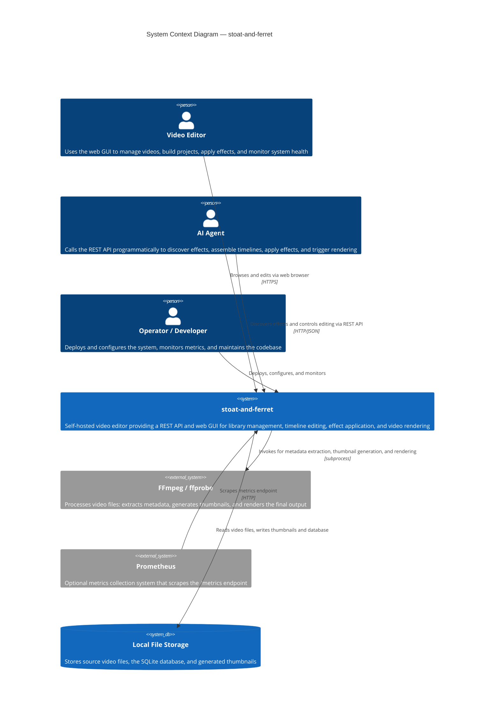

# C4 Context Level: System Context

## System Overview

### Short Description

stoat-and-ferret is an AI-driven video editor that exposes a REST API for managing a video library, building editing projects, applying visual effects, and rendering output files.

### Long Description

stoat-and-ferret is a self-hosted video editing system designed for programmatic control. It provides a structured REST API that allows human users (via a web browser) and AI agents (via HTTP calls) to scan a local video library, assemble editing projects from clips on a timeline, apply visual effects such as text overlays and speed changes, and render the result to an output file.

The system is intentionally designed so that an AI agent can discover what operations are available — the effects endpoint returns machine-readable schemas and plain-language hints — and then issue the same API calls a human would make. This makes the system usable by natural-language-driven automation without requiring custom integrations.

Video processing is handled by FFmpeg, which the system invokes as a background subprocess. All safety-critical work — path validation to prevent directory traversal, FFmpeg filter text sanitization to prevent command injection, and timeline arithmetic — is performed in a Rust library compiled into the server process, providing compile-time correctness guarantees.

The system is currently in alpha and targets single-user, single-machine deployment.

## System Context Diagram

## Personas

### Video Editor (Human User)

- **Type**: Human User
- **Description**: A person who wants to manage a local collection of video files, cut and arrange clips into a project, add text or speed effects, and export a finished video. Uses the React web GUI in a browser.
- **Goals**: Scan folders of source footage into a searchable library, build an editing project by assembling clips on a timeline, apply visual effects, and render the project to an output file.
- **Key Features Used**: Video Library Management, Video Search, Project and Timeline Management, Clip Editing, Effect Application, Real-Time Dashboard

### AI Agent (Programmatic User)

- **Type**: Programmatic User
- **Description**: A software agent (such as a Claude Code session or a script) that drives the editing workflow through the REST API, guided by natural language instructions from a person. The API is deliberately designed so agents can discover what is available and what parameters effects accept before issuing commands.
- **Goals**: Discover available effects and their parameter schemas, assemble clips on a timeline through sequential API calls, apply effects using the machine-readable AI hints, trigger rendering, and poll for job completion.
- **Key Features Used**: Effect Discovery, Project and Timeline Management, Clip Editing, Effect Application, Job Status Polling

### Operator / Developer

- **Type**: Human User
- **Description**: The person who installs and runs the server, sets configuration via environment variables, monitors system health and Prometheus metrics, and contributes to the codebase.
- **Goals**: Verify the system is healthy, understand current resource usage, diagnose failures using structured logs and correlation IDs, and extend or maintain the system.
- **Key Features Used**: Health Checks, Metrics Endpoint, Real-Time Dashboard

## System Features

| Feature | Description | Personas |
|---------|-------------|----------|
| Video Library Management | Scan one or more local directories to discover video files. Metadata (duration, resolution, codec, frame rate) is extracted and stored. Thumbnails are generated automatically. | Video Editor, AI Agent |
| Video Search | Full-text search across filenames and paths using a SQLite full-text index. Supports pagination and sorting. | Video Editor, AI Agent |
| Project and Timeline Management | Create named editing projects, add clips from the library to a timeline, reorder clips, and delete projects. Timeline positions are calculated by the Rust core. | Video Editor, AI Agent |
| Clip Editing | Trim clips with in-point and out-point settings, update clip parameters, and remove clips from a project. Validation is performed by the Rust core. | Video Editor, AI Agent |
| Effect Application | Apply visual effects to individual clips. Currently includes text overlay (positioned, styled text with optional fade) and speed control (slow motion or time-lapse with automatic audio adjustment). The Rust core generates the FFmpeg filter string for each effect and returns it transparently in the response. | Video Editor, AI Agent |
| Effect Discovery | The effects endpoint returns all registered effects with parameter schemas, plain-language AI hints, and a sample filter preview. Designed for AI agents to learn what is available before issuing commands. | AI Agent |
| Asynchronous Job Queue | Long-running operations (directory scanning, effect application) are submitted as jobs and processed in the background. Callers poll a job status endpoint for results. | Video Editor, AI Agent |
| Real-Time Dashboard | The web GUI provides a live view of system health, Prometheus metrics, and a WebSocket activity log showing recent events (scans started, projects created, health checks). | Video Editor, Operator |
| Health Checks | Liveness and readiness probes check the database connection and FFmpeg availability. The readiness probe includes the Rust core version. | Operator |
| Metrics Endpoint | Prometheus-format metrics covering HTTP request counts, request durations, and active FFmpeg processes. | Operator |

## User Journeys

### Video Editor: Import and Browse the Video Library

1. The editor opens the web GUI in a browser and navigates to the Library page.
2. The editor enters a local folder path and triggers a directory scan. The server submits the scan as an async job and returns a job ID immediately.
3. The GUI polls the job status endpoint until the scan completes, then shows a summary of files found.
4. The editor browses the video grid, which shows thumbnails and metadata for each file.
5. The editor uses the search bar to find specific clips by filename.

### Video Editor: Build a Project and Apply an Effect

1. The editor navigates to the Projects page and creates a new project with a name and output resolution.
2. The editor adds clips from the library to the project timeline, setting in-point and out-point for each clip. The server validates that clip boundaries fall within the source video duration.
3. The editor applies a text overlay effect to the first clip, choosing a position preset (for example, "center"). The server invokes the Rust core to generate the FFmpeg drawtext filter and stores it on the clip, returning the filter string in the response.
4. The editor applies a speed control effect to a later clip to create a slow-motion segment.

### AI Agent: Discover Effects and Apply via REST API

1. The agent calls `GET /api/v1/effects` and receives a list of all registered effects, including parameter schemas and plain-language AI hints for each field.
2. Based on the effect schemas, the agent constructs a `POST /api/v1/effects/{effect_type}/apply` request with the desired effect type and parameters.
3. The server validates the parameters, generates the filter string via the Rust core, stores the effect on the clip, and returns the filter string in the response.
4. The agent polls `GET /api/v1/jobs/{job_id}` until the job status is "complete".

### Operator: Monitor System Health

1. The operator opens the web GUI Dashboard, which shows live health cards for the database, FFmpeg, and Rust core.
2. The operator checks `GET /health/ready` directly to verify the system is accepting traffic.
3. The operator views the Prometheus metrics at `/metrics` or configures Prometheus to scrape the endpoint periodically.
4. When investigating a failure, the operator correlates structured log entries using the correlation ID present in each request and response.

## External Systems and Dependencies

### FFmpeg / ffprobe

- **Type**: External binary (subprocess)
- **Description**: Industry-standard video processing tools. ffprobe extracts video metadata (duration, resolution, codec, frame rate, audio channels). FFmpeg generates thumbnail images and renders the final project output file.
- **Integration Type**: subprocess invocation — the server builds a command string using the Rust core and runs it as a child process.
- **Purpose**: All actual video file processing happens in FFmpeg. stoat-and-ferret does not read or write video frames directly. Must be installed on the host machine; the readiness health check verifies FFmpeg is available.

### Prometheus (optional)

- **Type**: External metrics collection system
- **Description**: A time-series database that scrapes HTTP metrics endpoints at a configured interval.
- **Integration Type**: Pull-based HTTP scrape of `/metrics`.
- **Purpose**: Long-term retention, alerting, and dashboarding of system metrics. Not required for core functionality — the metrics endpoint is always exposed, but Prometheus scraping it is optional.

### Local File Storage

- **Type**: Local filesystem
- **Description**: The directories that hold source video files (configured by the operator via `STOAT_ALLOWED_SCAN_ROOTS`), the SQLite database file (`data/stoat.db`), and generated thumbnails (`data/thumbnails/`).
- **Integration Type**: File I/O — the server reads video files for scanning and thumbnail generation, and writes thumbnail images.
- **Purpose**: Persistent storage for all application data. Scan root directories are validated by the Rust core to prevent directory traversal.

## Related Documentation

- [Container Documentation](./c4-container.md)
- [Component Documentation](./c4-component.md)
