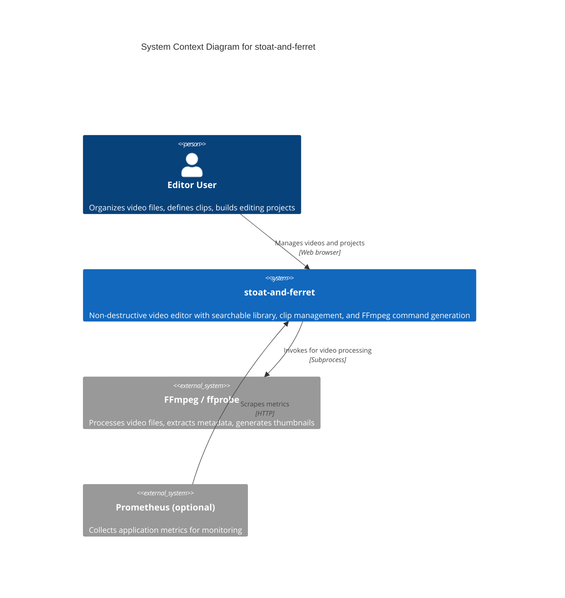

# C4 Context Level: System Context

## System Overview

### Short Description

stoat-and-ferret is a self-hosted video editor that lets users organize video libraries, define clips, and build FFmpeg editing commands through a web browser.

### Long Description

stoat-and-ferret is an AI-driven, non-destructive video editing application built for users who want a browser-based interface for managing video files, defining editing decisions, and producing FFmpeg commands. It scans local directories to build a searchable video library, lets users create editing projects with frame-accurate clip definitions, and constructs type-safe FFmpeg commands for video processing.

The system uses a hybrid Python/Rust architecture: a Python FastAPI server handles the web interface and orchestration, while a Rust core library provides frame-accurate timeline math, clip validation, and safe FFmpeg command construction. A React single-page application provides the browser UI with real-time updates via WebSocket.

The project is currently in alpha. The API server and GUI run locally. Planned features include a visual effects engine with text overlays, speed control, audio mixing, and transitions.

## System Context Diagram

## Personas

### Editor User
- **Type**: Human User
- **Description**: Someone who works with video files and needs to organize, search, and define editing decisions. Uses the web interface to browse a video library, create projects, and manage clips on a timeline.
- **Goals**: Scan and organize video files into a searchable library; create editing projects with frame-accurate clip definitions; generate FFmpeg commands for video processing.
- **Key Features Used**: Video Library, Directory Scanning, Project Management, Clip Editing, Dashboard Monitoring

### Prometheus Monitoring (optional)
- **Type**: External System
- **Description**: A metrics collection system that periodically scrapes the application's metrics endpoint. Not required for core functionality.
- **Goals**: Collect request counts and duration histograms for operational visibility.
- **Key Features Used**: Prometheus Metrics

## System Features

| Feature | Description | Personas | Components |
|---------|-------------|----------|------------|
| Video Library | Browse, search, sort, and paginate a catalog of video files with metadata | Editor User | Web GUI, API Gateway, Data Access Layer |
| Directory Scanning | Scan local directories to discover video files and extract metadata via ffprobe | Editor User | Web GUI, API Gateway, Application Services |
| Thumbnail Generation | Automatically generate JPEG preview thumbnails for scanned videos | Editor User | Application Services, File Storage |
| Project Management | Create, list, and delete editing projects with output settings (resolution, frame rate) | Editor User | Web GUI, API Gateway, Data Access Layer |
| Clip Editing | Define, update, and delete clips with frame-accurate in/out points and timeline positions, validated against source constraints | Editor User | Web GUI, API Gateway, Data Access Layer, Rust Core Engine |
| FFmpeg Command Building | Construct type-safe FFmpeg commands with filters, codecs, and parameters, protected against injection | Editor User | Rust Core Engine, Python Bindings |
| Real-time Dashboard | Monitor system health, view live WebSocket activity, and check readiness status | Editor User | Web GUI, API Gateway |
| Full-text Search | Search videos by filename and file path using SQLite FTS5 indexing | Editor User | API Gateway, Data Access Layer |
| Prometheus Metrics | Expose request count and duration histograms at /metrics | Prometheus | API Gateway |
| Audit Logging | Track all data changes with before/after diffs for accountability | Editor User | Data Access Layer |

## User Journeys

### Video Library — Editor User Journey

1. **Start the application**: Run `python -m stoat_ferret.api` to start the server locally on port 8000.
2. **Open the browser**: Navigate to `http://localhost:8000/gui` to load the web interface.
3. **Scan a directory**: Click "Scan" in the library view, enter a directory path, and submit. The system scans for video files in the background and extracts metadata via ffprobe.
4. **Browse the library**: Videos appear in the library with thumbnails, filenames, durations, and dimensions. Sort by name or date, paginate through results.
5. **Search for videos**: Type a filename or path fragment into the search box. Results update using full-text search.

### Project and Clip Editing — Editor User Journey

1. **Create a project**: Navigate to the Projects view and click "Create Project". Enter a name and output settings (resolution, frame rate).
2. **Add clips**: Select videos from the library and define clips with in-point, out-point, and timeline position. The system validates that clip boundaries fall within the source video's duration.
3. **Adjust clips**: Update clip positions or trim points. The Rust core ensures frame-accurate validation.
4. **Review the timeline**: See all clips in the project view with their positions and durations.

### Prometheus Integration Journey

1. **Configure scrape target**: Add `http://<host>:8000/metrics` as a Prometheus scrape target.
2. **Scrape metrics**: Prometheus periodically sends GET requests to `/metrics`.
3. **Receive data**: The endpoint returns request counts and duration histograms in Prometheus exposition format.

## External Systems and Dependencies

### FFmpeg / ffprobe
- **Type**: External binary (command-line tool)
- **Description**: Industry-standard video processing toolkit. ffprobe extracts video metadata (duration, dimensions, codecs, frame rate). FFmpeg generates thumbnails and processes video.
- **Integration**: Invoked as a subprocess by the API Server
- **Purpose**: All video metadata extraction, thumbnail generation, and video processing depend on these binaries being installed on the host system.

### Prometheus (optional)
- **Type**: Monitoring service
- **Description**: Time-series metrics collection system that scrapes HTTP endpoints.
- **Integration**: Sends HTTP GET requests to `/metrics` on a configured interval
- **Purpose**: Operational monitoring of request rates and response times. Not required for any core editing functionality.

## Related Documentation
- [Container Architecture](./c4-container.md)
- [Component Architecture](./c4-component.md)
